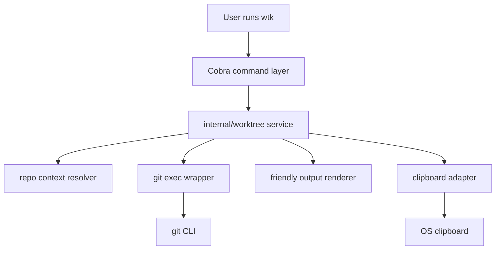

## Overview

### Problem Statement

当前仓库需要基于 `worktree-basic-operations.md` 中“四个基本操作”的思想，实现一个用户友好的 Git worktree 命令行工具。工具命名为 `worktree-kit`，命令简写为 `wtk`，用于把常见 worktree 流程收敛为四个清晰操作。

### Goals

- 使用 Go 1.25 实现 `wtk` 命令行工具。
- 支持四个基本命令：`create`、`remove`、`send-out`、`bring-in`。
- 每个命令展示用户友好的执行信息：包含底层 Git worktree 命令，同时保持简洁。
- 适当使用终端颜色、加粗等方式优化输出可读性。
- 命令完成后复制相关信息到剪贴板，例如 `create` 成功后复制 worktree 目录路径，方便用户继续操作。
- 默认 worktree 路径沿用旧 `g-wt-*` 习惯：sibling directory，目录名为 `<repo>-wt-<branch-slug>`。
- 基于默认主分支创建新 worktree 前，自动 fetch 并 fast-forward 本地主分支到 `origin/<main-branch>`。
- E2E 测试每个 case 在 `/tmp` 下创建全新的 Git repo，并在 CI 中运行。
- 支持 tab 自动补全。

### Scope

- `wtk create`
- `wtk remove`
- `wtk send-out`
- `wtk bring-in`
- 面向 Git worktree 的 CLI 输出、剪贴板集成、补全脚本、e2e 测试和 CI 验证。

### Constraints

- 行为应遵循 `worktree-basic-operations.md` 描述的四个基本操作模型。
- 项目仓库将发布在 `https://github.com/nettee/worktree-kit`。
- 需要处理边界情况：
  - 主分支名称可能不是 `main`。
  - 当前操作可能不在 Git root 目录执行。
  - Git 存在未提交文件时需要直接报错。
- 错误应清晰暴露，避免静默失败或伪成功。

### Success Criteria

- 用户可以通过 `wtk create|remove|send-out|bring-in` 完成四类 worktree 操作。
- 输出能看懂实际发生了什么，并能看到对应的底层 Git 命令。
- 成功操作会复制对用户有用的路径或分支信息到剪贴板。
- e2e 测试覆盖主要流程和边界情况。
- tab 自动补全可用。

## Research

### Existing System

- 当前变更规格要求实现 `worktree-kit`/`wtk`，使用 Go 1.25，支持 `create`、`remove`、`send-out`、`bring-in` 四个命令。Source: `specs/change/20260510-worktree-kit-cli/spec.md:12,16-21,25-29`
- 规格明确要求处理非 `main` 主分支、非 Git root 目录执行、Git 未提交文件直接报错、tab 自动补全和 e2e 测试。Source: `specs/change/20260510-worktree-kit-cli/spec.md:31-46`
- 仓库根目录当前只包含 `.git/`、`.gitignore`、`.opencode/`、`specs/`；项目实现可以按绿色地基方式建立 Go module、CLI 入口和测试结构。Source: repository root listing; `.gitignore:1-4`; `.opencode/package.json:1-5`
- `worktree-basic-operations.md` 将 Git worktree 日常操作抽象为四个动作：`create`、`remove`、`send out`、`bring in`。Source: `specs/change/20260510-worktree-kit-cli/worktree-basic-operations.md:3-12`
- 四个操作的核心语义分别是新任务进入 linked worktree、linked worktree 退出、主 worktree 到 linked worktree、linked worktree 到主 worktree。Source: `specs/change/20260510-worktree-kit-cli/worktree-basic-operations.md:31-40`
- `create` 的底层 Git 命令是 `git worktree add`，常见形态包含已有分支、基于主分支创建新分支、PR review 分支。Source: `specs/change/20260510-worktree-kit-cli/worktree-basic-operations.md:60-68`
- `remove` 的底层 Git 命令是 `git worktree remove`，分支删除是独立选择。Source: `specs/change/20260510-worktree-kit-cli/worktree-basic-operations.md:88-95`
- `send out` 需要记录当前分支、切回默认分支、再为当前分支创建 linked worktree；它要求主 worktree 干净。Source: `specs/change/20260510-worktree-kit-cli/worktree-basic-operations.md:124-142`
- `bring in` 需要读取 linked worktree 当前分支、删除 linked worktree、再在主 worktree checkout 该分支。Source: `specs/change/20260510-worktree-kit-cli/worktree-basic-operations.md:170-186`
- 文档建议 sibling directory 布局；WTK 继承旧 `g-wt-*` 的 `<project>-wt-<branch-slug>` 命名约定，用于保持迁移后的目录肌肉记忆和脚本路径稳定性。Source: `specs/change/20260510-worktree-kit-cli/worktree-basic-operations.md:188-204`; `/Users/william/projects/iconfig/zsh/git-worktree.zsh:38-47`

### Available Approaches

- **Cobra CLI**: 支持层级命令、`AddCommand` 子命令注册、flag，并内置 bash/zsh/fish/powershell 补全生成能力。Source: `https://pkg.go.dev/github.com/spf13/cobra#Command`; `https://github.com/spf13/cobra/blob/main/site/content/completions/_index.md`
- **urfave/cli v3**: 支持通过 `Commands` 声明子命令，开启 `EnableShellCompletion` 后提供 shell completion。Source: `https://pkg.go.dev/github.com/urfave/cli/v3#Command`; `https://cli.urfave.org/v3/completions/shell-completions/`
- **fatih/color**: 提供简单 ANSI 颜色输出函数，适合短 CLI 状态和错误信息。Source: `https://pkg.go.dev/github.com/fatih/color`; `https://github.com/fatih/color`
- **charmbracelet/lipgloss**: 提供声明式终端样式、颜色 profile 和自适应颜色，适合更结构化的输出。Source: `https://pkg.go.dev/github.com/charmbracelet/lipgloss`; `https://github.com/charmbracelet/lipgloss#adaptive-colors`
- **atotto/clipboard**: 提供跨平台 `WriteAll`/`ReadAll` 文本剪贴板 API。Source: `https://pkg.go.dev/github.com/atotto/clipboard`; `https://github.com/atotto/clipboard`
- **golang.design/x/clipboard**: 提供文本和图片等多格式剪贴板能力。Source: `https://pkg.go.dev/golang.design/x/clipboard`; `https://github.com/golang-design/x-clipboard`
- **Go stdlib e2e 测试**: `os/exec` 可启动 CLI 二进制、捕获输出和退出码，适合验证真实命令行行为。Source: `https://pkg.go.dev/os/exec`

### Constraints & Dependencies

- 项目仓库目标地址为 `https://github.com/nettee/worktree-kit`，Go module path 和安装文档需要围绕该地址设计。Source: user clarification on 2026-05-10
- `send out` 和 `bring in` 默认要求相关 worktree 干净，未提交改动需要用户先提交、拆分或明确选择其他迁移策略。Source: `specs/change/20260510-worktree-kit-cli/worktree-basic-operations.md:16-21,142`
- 同一个任务分支同一时间只归属于一个 worktree；`send out`/`bring in` 转移的是分支 checkout 归属位置。Source: `specs/change/20260510-worktree-kit-cli/worktree-basic-operations.md:20-21,40`
- 主 worktree 承担稳定入口和完整本地环境，linked worktree 承担任务隔离。Source: `specs/change/20260510-worktree-kit-cli/worktree-basic-operations.md:25-29,146-148`
- 主分支名称需要从仓库事实中发现，规格明确要求主分支可能不是 `main`。Source: `specs/change/20260510-worktree-kit-cli/spec.md:31-36`
- CLI 必须能从非 Git root 目录执行，并定位正确仓库上下文。Source: `specs/change/20260510-worktree-kit-cli/spec.md:31-37`
- 失败状态需要直接暴露，符合规格中的清晰报错要求。Source: `specs/change/20260510-worktree-kit-cli/spec.md:37-38`

### Key References

- `specs/change/20260510-worktree-kit-cli/spec.md:10-46` - 用户需求、目标、范围、边界情况和成功标准。
- `specs/change/20260510-worktree-kit-cli/worktree-basic-operations.md:31-40` - 四个基本操作模型。
- `specs/change/20260510-worktree-kit-cli/worktree-basic-operations.md:60-68,88-95,124-142,170-186` - 四个命令对应的底层 Git 命令形态。
- `https://pkg.go.dev/github.com/spf13/cobra#Command` - Cobra 命令模型。
- `https://github.com/spf13/cobra/blob/main/site/content/completions/_index.md` - Cobra shell completion。
- `https://pkg.go.dev/os/exec` - Go e2e 测试中执行 CLI 的标准库能力。

## Design

### Architecture Overview



The CLI will use a thin command layer and put workflow behavior in `internal/worktree`. Every mutating command performs preflight validation, prints the Git commands it will run, executes through a Git wrapper, copies the relevant success payload, and reports partial failures explicitly.

### Change Scope

- Area: Go module and binary entrypoint. Impact: initialize module `github.com/nettee/worktree-kit`, build binary `wtk`, and keep future install path aligned with the target repository. Source: `specs/change/20260510-worktree-kit-cli/spec.md:16,31-34,74-77`
- Area: CLI command layer. Impact: add `create`, `remove`, `send-out`, `bring-in`, and `completion` commands. Source: `specs/change/20260510-worktree-kit-cli/spec.md:16-21,41-47`; `https://pkg.go.dev/github.com/spf13/cobra#Command`
- Area: Git workflow service. Impact: encode the four documented worktree operations and their Git command sequences. Source: `specs/change/20260510-worktree-kit-cli/worktree-basic-operations.md:31-40,60-68,88-95,124-142,170-186`
- Area: Repository context resolution. Impact: support execution from subdirectories and linked worktrees by resolving invocation cwd, current worktree root, main worktree root, Git common dir, and known worktrees. Source: `specs/change/20260510-worktree-kit-cli/spec.md:35-39`
- Area: Output and clipboard. Impact: print concise styled output with underlying Git commands and copy useful success payloads. Source: `specs/change/20260510-worktree-kit-cli/spec.md:18-20,43-45`
- Area: E2E tests. Impact: create real temporary Git repositories and validate commands, edge cases, completion generation, and clipboard behavior. Source: `specs/change/20260510-worktree-kit-cli/spec.md:45-47`; `https://pkg.go.dev/os/exec`

### Design Decisions

- Decision: Use Cobra for command routing and shell completion. Source: `specs/change/20260510-worktree-kit-cli/spec.md:16-21,41-47`; `https://pkg.go.dev/github.com/spf13/cobra#Command`; `https://github.com/spf13/cobra/blob/main/site/content/completions/_index.md`
- Decision: Use `github.com/fatih/color` for simple status/error styling. Source: `specs/change/20260510-worktree-kit-cli/spec.md:18-19`; `https://pkg.go.dev/github.com/fatih/color`
- Decision: Use `github.com/atotto/clipboard` for text clipboard writes. Source: `specs/change/20260510-worktree-kit-cli/spec.md:20,43-45`; `https://pkg.go.dev/github.com/atotto/clipboard`
- Decision: Run real `git` through a small `internal/gitexec` wrapper instead of reimplementing Git semantics. Source: `specs/change/20260510-worktree-kit-cli/worktree-basic-operations.md:60-68,88-95,124-142,170-186`
- Decision: Detect the main branch by precedence: explicit flag, `worktree-kit.mainBranch` Git config, `origin/HEAD`, then a single unambiguous local candidate among `main`, `master`, `trunk`, `develop`; fail with a clear message when ambiguous. Source: `specs/change/20260510-worktree-kit-cli/spec.md:35-39,74-82`
- Decision: Generate default linked worktree paths as sibling directories named `<repo>-wt-<branch-slug>`, preserving the old `g-wt-*` path convention. Source: `/Users/william/projects/iconfig/zsh/git-worktree.zsh:38-47`
- Decision: When `create --new` uses the detected default main branch as base, first run `git fetch origin <main-branch>` and fast-forward/update the local main branch to `origin/<main-branch>` before creating the new branch. If the local main branch is checked out in another worktree and cannot be updated in place, use `origin/<main-branch>` as the base and report that choice. Source: `/Users/william/projects/iconfig/zsh/git-worktree.zsh:91-99`
- Decision: Resolve repo context before command behavior using `git rev-parse --show-toplevel`, absolute Git dir/common-dir queries, and `git worktree list --porcelain`. Source: `specs/change/20260510-worktree-kit-cli/spec.md:35-39,80-82`
- Decision: Check cleanliness before mutation with `git status --porcelain=v1 --untracked-files=normal` for each affected worktree. Source: `specs/change/20260510-worktree-kit-cli/spec.md:35-39`; `specs/change/20260510-worktree-kit-cli/worktree-basic-operations.md:16-21,142`
- Decision: Treat clipboard copy as part of default success path; if Git succeeds and clipboard fails, print the Git success, print the clipboard error, and exit non-zero. Add `--no-clipboard` for CI/headless flows. Source: `specs/change/20260510-worktree-kit-cli/spec.md:20,37-45`
- Decision: `send-out` and `bring-in` model branch checkout ownership transfer, using preflight validation around multi-step Git mutations. Source: `specs/change/20260510-worktree-kit-cli/worktree-basic-operations.md:20-21,40,134-142,180-186`

### Why this design

- Cobra matches the command and completion requirements with less custom shell code.
- A service layer keeps workflow semantics testable and keeps Cobra handlers small.
- Real Git execution makes e2e tests validate the same behavior users will run.
- Explicit main-branch detection avoids hard-coded `main` assumptions.
- Fail-fast preflight checks make dirty state, ambiguous defaults, missing Git context, and clipboard issues visible.

### Command Contracts

#### `wtk create <branch> [--path <path>] [--base <branch>] [--new] [--no-clipboard]`

- Default path: sibling directory beside the main worktree, named `<repo>-wt-<branch-slug>`.
- Existing branch/ref: run `git worktree add <path> <branch>`.
- New branch: run `git worktree add -b <branch> <path> <base>`.
- Default `--base`: detected main branch.
- When `--new` uses the detected default main branch as base, first run `git fetch origin <main-branch>`, then update local `<main-branch>` to `origin/<main-branch>` before `git worktree add -b`. If local main is checked out in another worktree and cannot be force-updated, use `origin/<main-branch>` as the base and print that fallback explicitly.
- Success clipboard payload: created worktree path.
- Dynamic completions: branch names for `<branch>` and `--base`.

#### `wtk remove [path] [--delete-branch] [--no-clipboard]`

- If invoked inside a linked worktree and `path` is omitted, target the current linked worktree.
- If invoked from the main worktree, require `path`.
- Preflight: target linked worktree must be clean.
- Run `git worktree remove <path>`.
- With `--delete-branch`, run `git branch -d <branch>` after removing the worktree.
- Success clipboard payload: removed path; when `--delete-branch` is used, include deleted branch name in output.
- Dynamic completions: linked worktree paths.

#### `wtk send-out [--path <path>] [--base <branch>] [--no-clipboard]`

- Must be invoked from the main worktree.
- Current branch must differ from the detected base branch.
- Preflight: main worktree must be clean.
- Sequence: record current branch, switch main worktree to base branch, add linked worktree for the recorded branch.
- Default path: sibling directory beside the main worktree, named `<repo>-wt-<branch-slug>`.
- Success clipboard payload: created linked worktree path.

#### `wtk bring-in <linked-worktree-path> [--no-clipboard]`

- Must be invoked from the main worktree.
- Preflight: main worktree and linked worktree must be clean.
- Sequence: read linked worktree branch, validate branch can be checked out, remove linked worktree, switch main worktree to the branch.
- Success clipboard payload: branch brought into the main worktree.
- Dynamic completions: linked worktree paths.

#### `wtk completion <bash|zsh|fish|powershell>`

- Generate shell completion scripts through Cobra.
- Dynamic completions should return branch names or linked worktree paths where safe.
- Completion code should produce empty candidates when Git context is unavailable.

### Test Strategy

- Unit tests: branch slugging, default path generation, main branch detection precedence, clean-state parsing, worktree-list parsing, command rendering, and clipboard adapter behavior.
- Command tests: Cobra argument validation, flag parsing, completion command generation, and dynamic completion fallback behavior.
- E2E tests: build the `wtk` binary once, create a fresh Git repository under `/tmp` for each test case, run commands with `os/exec`, and assert exit codes, output, Git state, paths, and copied payload behavior. Source: `https://pkg.go.dev/os/exec`
- CI: run unit, command, and e2e tests in GitHub Actions so the real Git workflow behavior is validated on every push and pull request.
- E2E isolation: each case must initialize its own repo, commit fixture files, configure the needed default branch/remote/worktrees, and clean up its temp directory through the test framework.
- E2E cases:
  - `create` existing branch with `--no-clipboard`.
  - `create --new --base trunk` in a repo whose default branch is `trunk`.
  - `create --new` fetches `origin/<main-branch>`, updates the local main branch, and creates the new branch from the updated base.
  - default worktree paths include the `-wt-` infix, for example `<repo>-wt-feature-foo`.
  - `remove` linked worktree.
  - `send-out` from a subdirectory.
  - `bring-in` from the main worktree using a linked path.
  - dirty main worktree fails for `send-out`.
  - dirty linked worktree fails for `bring-in` and `remove`.
  - ambiguous main branch detection fails with actionable diagnostics.
  - clipboard failure after Git success exits non-zero and reports partial success.
  - completion scripts generate output for bash, zsh, fish, and powershell.

### Pseudocode

```text
run command:
  ctx = resolveRepoContext(invocationCwd)
  opts = parse command flags and args
  plan = worktree service builds command plan
  preflight(plan)
  output.showPlan(plan.gitCommands)
  result = executeGit(plan.gitCommands)
  output.showGitResult(result)
  if clipboard enabled:
    copy result.clipboardPayload
    if copy fails:
      output.showPartialFailure(copyError)
      exit non-zero
  output.showSuccess(result.summary)
```

```text
detect main branch:
  if explicit flag: return flag
  if git config worktree-kit.mainBranch exists: return config
  if origin/HEAD exists: return stripped remote default
  candidates = local branches intersecting main, master, trunk, develop
  if exactly one candidate: return candidate
  fail with instructions to pass --base or configure worktree-kit.mainBranch
```

```text
prepare default base for create --new:
  base = detect main branch
  if --base was explicitly provided and differs from detected main branch: return base unchanged
  run git fetch origin base
  try git branch -f base origin/base
  if branch update fails because base is checked out in another worktree:
    report that origin/base will be used directly
    return origin/base
  if branch update fails for any other reason: fail
  return base
```

### File Structure

- `go.mod` - module `github.com/nettee/worktree-kit`, Go 1.25.
- `cmd/wtk/main.go` - binary entrypoint.
- `internal/cli/root.go` - root command, global flags, completion command wiring.
- `internal/cli/create.go` - `create` command parsing and dynamic completion.
- `internal/cli/remove.go` - `remove` command parsing and dynamic completion.
- `internal/cli/send_out.go` - `send-out` command parsing.
- `internal/cli/bring_in.go` - `bring-in` command parsing and dynamic completion.
- `internal/worktree/service.go` - command contracts and workflow orchestration.
- `internal/worktree/paths.go` - slugging, default paths using `<repo>-wt-<branch-slug>`, path resolution.
- `internal/gitexec/git.go` - Git command execution wrapper.
- `internal/gitexec/repo.go` - repo/worktree context discovery.
- `internal/output/output.go` - styled output and command rendering.
- `internal/clipboard/clipboard.go` - clipboard adapter and `--no-clipboard` behavior.
- `internal/e2etest/` or `test/e2e/` - e2e helpers and Git repository fixtures.
- `.github/workflows/ci.yml` - run Go tests including e2e coverage on push and pull request.
- `README.md` - install, usage, command examples, completion setup.

### Interfaces / APIs

```text
type Runner interface {
  Run(ctx, dir, args) (stdout, stderr, error)
}

type Clipboard interface {
  WriteText(text string) error
}

type Service struct {
  Git Runner
  Clipboard Clipboard
  Output Output
}
```

Service methods:

- `Create(ctx, opts) (Result, error)`
- `Remove(ctx, opts) (Result, error)`
- `SendOut(ctx, opts) (Result, error)`
- `BringIn(ctx, opts) (Result, error)`

### Edge Cases

- Invoked outside a Git repository: fail before running workflow commands.
- Invoked from a subdirectory: resolve current worktree root and run Git with `-C <root>`.
- Main branch name is ambiguous: fail with `--base` and `git config worktree-kit.mainBranch` guidance.
- Dirty worktree: fail before mutation and print `git status --short` style entries.
- Target path already exists: fail before `git worktree add` unless Git reports a more specific error.
- Default base update fetch fails: fail before creating the worktree and print the failed `git fetch` command.
- Default base fast-forward/update fails because the branch is checked out in another worktree: use `origin/<main-branch>` as the create base and print the fallback explicitly.
- Default base fast-forward/update fails for another reason: fail before creating the worktree and print the failed command.
- Branch already checked out in another worktree: fail with Git error and show involved command.
- `send-out` from linked worktree: fail with a main-worktree requirement.
- `send-out` while already on base branch: fail with an explanation that there is no task branch to transfer.
- `bring-in` target is the main worktree or an unknown path: fail before mutation.
- `bring-in` final checkout validation fails: stop before removal when detectable; if a later Git failure occurs, report the completed and pending recovery steps.
- Clipboard unavailable: Git result remains printed, command exits non-zero unless `--no-clipboard` is set.

## Plan

- [x] Step 1: Project foundation and shared infrastructure
  - [x] Substep 1.1 Implement: initialize Go module, `cmd/wtk`, Cobra root command, and dependency wiring.
  - [x] Substep 1.2 Implement: add Git runner, repo context resolver, output renderer, clipboard adapter, and shared result/error types.
  - [x] Substep 1.3 Implement: add unit tests for path generation, branch slugging, worktree list parsing, and main branch detection.
  - [x] Substep 1.4 Verify: run `go test ./...`.
- [x] Step 2: Create and remove workflows
  - [x] Substep 2.1 Implement: `wtk create` with existing branch, new branch, `<repo>-wt-<branch-slug>` default path, base branch detection, default-base fetch/update, output, and clipboard behavior.
  - [x] Substep 2.2 Implement: `wtk remove` with current linked worktree detection, explicit path removal, clean-state check, and optional `--delete-branch`.
  - [x] Substep 2.3 Verify: add unit and e2e tests for create/remove success paths and dirty linked worktree failure.
  - [x] Substep 2.4 Verify: run `go test ./...`.
- [x] Step 3: Send-out and bring-in workflows
  - [x] Substep 3.1 Implement: `wtk send-out` with main-worktree requirement, clean-state preflight, base branch switch, and linked worktree creation.
  - [x] Substep 3.2 Implement: `wtk bring-in` with main-worktree requirement, linked worktree validation, dual clean-state checks, removal, and checkout.
  - [x] Substep 3.3 Verify: add e2e tests for subdirectory invocation, non-`main` base branch, dirty main failure, dirty linked failure, and ambiguous main branch failure.
  - [x] Substep 3.4 Verify: run `go test ./...`.
- [x] Step 4: Completion, docs, and release readiness
  - [x] Substep 4.1 Implement: `wtk completion` and dynamic completions for branches and linked worktree paths.
  - [x] Substep 4.2 Implement: README usage, install instructions, completion setup, command examples, and failure behavior notes.
  - [x] Substep 4.3 Implement: GitHub Actions CI running `go test ./...`, including e2e tests that create fresh repos under `/tmp`.
  - [x] Substep 4.4 Verify: add completion tests and clipboard partial-failure tests.
  - [x] Substep 4.5 Verify: run `go test ./...` and manually build `go build ./cmd/wtk`.

## Notes

<!-- Optional sections — add what's relevant. -->

### Implementation

- `go.mod`, `go.sum`, `cmd/wtk/main.go` - initialized Go 1.25 module and `wtk` binary entrypoint.
- `internal/cli/*` - added Cobra root command, `create`, `remove`, `send-out`, `bring-in`, completion command, and dynamic branch/worktree completions.
- `internal/worktree/*` - implemented worktree workflows, branch slug/default path logic, cleanliness checks, main branch detection, default-base preparation, clipboard success path, and fail-fast partial clipboard errors.
- `internal/worktree/service.go` - default base updates now verify fast-forward ancestry before moving a local base branch; partial failures for `send-out` and `remove --delete-branch` include recovery context.
- `internal/gitexec/*`, `internal/output/*`, `internal/clipboard/*` - added Git command runner, repository/worktree context resolution, styled output, and clipboard adapter.
- `internal/*/*_test.go`, `test/e2e/wtk_test.go` - added unit coverage and real Git E2E coverage using fresh temp repositories.
- `README.md`, `.github/workflows/ci.yml` - documented install/usage/completion/failure behavior and added CI test workflow.

### Verification

- `gofmt -w cmd internal test` completed.
- `go test ./...` passed.
- `go build ./cmd/wtk` passed.
- E2E coverage includes create/remove/send-out/bring-in, subdirectory invocation, non-`main` base branch, dirty main failure, dirty linked failure, ambiguous main branch failure, default base fetch/fast-forward, non-fast-forward refusal, and completion script generation.
