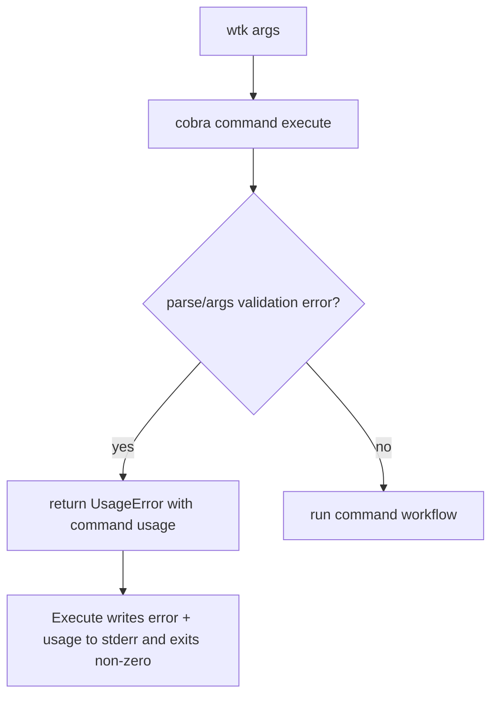

## Overview

### Problem Statement

`wtk create` 在参数缺失等不合适场景下只输出类似 `accepts 1 arg(s), received 0` 的简短错误，用户需要额外运行 `--help` 才能看到正确用法。错误反馈需要更明确、更友好。

### Goals

- 当命令参数不合适时，输出明确的报错原因。
- 参数错误时同时输出该命令的用法，效果接近 `--help`。
- 覆盖所有命令的参数错误体验。

### Scope

- 优化 CLI 命令参数校验失败时的错误信息和 usage 输出。
- 以 `wtk create` 缺少 `<branch>` 参数的场景作为已知示例。

### Success Criteria

- 用户执行参数不完整或不合法的命令时，可以直接从错误输出理解问题原因。
- 同一次错误输出包含可执行的命令用法或 flags 提示。
- 所有命令采用一致的参数错误展示方式。

## Research

### Existing System

- CLI 根命令由 Cobra 构建，`Execute` 创建 root、设置参数并执行；root 当前设置 `SilenceUsage: true` 和 `SilenceErrors: true`。Source: `internal/cli/root.go:19-35`
- `cmd/wtk/main.go` 在 `cli.Execute` 返回错误时只把错误文本写入 stderr 并以 1 退出。Source: `cmd/wtk/main.go:11-15`
- `create` 使用 `Use: "create <branch>"` 和 `Args: cobra.ExactArgs(1)` 做参数数量校验。Source: `internal/cli/create.go:8-18`
- 其他子命令也依赖 Cobra Args 校验：`remove` 使用 `cobra.MaximumNArgs(1)`，`bring-in` 使用 `cobra.ExactArgs(1)`，`send-out` 使用 `cobra.NoArgs`，`completion` 使用 `cobra.ExactArgs(1)`。Source: `internal/cli/remove.go:8-14`, `internal/cli/bring_in.go:8-14`, `internal/cli/send_out.go:8-14`, `internal/cli/root.go:116-121`
- E2E 测试通过构建 `./cmd/wtk` 后执行真实二进制，并用 `CombinedOutput` 同时捕获 stdout/stderr。Source: `test/e2e/wtk_test.go:178-186,226-230`

### Available Approaches

- **Centralized Cobra error handling**: 在 `Execute` 或 root 层统一执行命令，识别参数校验错误后打印错误与对应命令 usage。Source: `internal/cli/root.go:19-35`, `cmd/wtk/main.go:11-15`
- **Per-command Args wrappers**: 将各命令的 `Args` 替换为自定义校验函数，返回更明确错误。Source: `internal/cli/create.go:8-18`, `internal/cli/remove.go:8-14`, `internal/cli/bring_in.go:8-14`, `internal/cli/send_out.go:8-14`
- **Test through CLI binary**: 用现有 E2E harness 验证缺参、多参、禁参等用户可见输出。Source: `test/e2e/wtk_test.go:217-230`

### Constraints & Dependencies

- root 当前静默 usage，所以 Cobra 参数错误不会自动展示用法。Source: `internal/cli/root.go:27-33`
- main 只接收 `error`，命令执行上下文中匹配到的具体子命令信息需要在 CLI 包内部处理。Source: `cmd/wtk/main.go:11-15`
- 所有命令需要一致体验，因此实现应避免只改 `create`。Source: `internal/cli/create.go:11-13`, `internal/cli/remove.go:11-13`, `internal/cli/bring_in.go:11-13`, `internal/cli/send_out.go:11-13`, `internal/cli/root.go:118-120`

### Key References

- `internal/cli/root.go:19-35` - CLI 执行入口和 root 配置。
- `internal/cli/create.go:8-18` - `wtk create` 参数定义和校验。
- `test/e2e/wtk_test.go:178-230` - 构建并执行真实 CLI 的测试工具。

## Design

### Architecture Overview

### Change Scope

- Area: CLI root execution wrapper. Impact: centralize user-facing argument and flag error formatting for all commands. Source: `internal/cli/root.go:19-35`
- Area: command argument validators. Impact: replace raw Cobra default positional errors with command-specific friendly messages where needed. Source: `internal/cli/create.go:11-13`, `internal/cli/remove.go:11-13`, `internal/cli/bring_in.go:11-13`, `internal/cli/send_out.go:11-13`, `internal/cli/root.go:118-120`
- Area: CLI E2E tests. Impact: verify real binary output contains a clear reason and usage. Source: `test/e2e/wtk_test.go:178-230`

### Design Decisions

- Decision: Keep `SilenceUsage` and `SilenceErrors` enabled on Cobra root, and implement explicit formatting in `cli.Execute` so main remains a small process boundary. Source: `internal/cli/root.go:19-35`, `cmd/wtk/main.go:11-15`
- Decision: Add a package-local `usageError` type carrying the user-facing error plus `UsageString()` from the command that failed. Cobra does not expose a stable public category for positional validation errors, so the CLI will mark its own validation errors. Source: `internal/cli/create.go:11-13`, `internal/cli/remove.go:11-13`, `internal/cli/bring_in.go:11-13`, `internal/cli/send_out.go:11-13`
- Decision: Use command-specific argument validators for existing commands, with messages such as `missing required argument: branch` and `too many arguments: expected at most 1 path`. Source: `internal/cli/create.go:11-13`, `internal/cli/remove.go:11-13`, `internal/cli/bring_in.go:11-13`, `internal/cli/send_out.go:11-13`, `internal/cli/root.go:118-120`
- Decision: Use `SetFlagErrorFunc` to wrap flag parsing errors with usage too, covering unknown flags and invalid flag values. Source: `internal/cli/root.go:27-35`
- Decision: Add E2E tests around the built CLI because the requirement is about user-visible terminal output. Source: `test/e2e/wtk_test.go:178-230`

### Why this design

- A single formatting path keeps all commands consistent.
- Command-specific validators produce clearer reasons than Cobra's generic `accepts N arg(s)` wording.
- Usage output stays tied to Cobra's generated help, so flags and command syntax remain accurate as commands evolve.

### Test Strategy

- Add E2E coverage for `wtk create` missing branch: output includes `missing required argument: branch`, `Usage:`, and `wtk create <branch> [flags]`. Source: `test/e2e/wtk_test.go:226-230`
- Add E2E coverage for too many args on `remove`, unexpected args on `send-out`, missing arg on `bring-in`, and invalid shell for `completion`. Source: `internal/cli/remove.go:11-13`, `internal/cli/send_out.go:11-13`, `internal/cli/bring_in.go:11-13`, `internal/cli/root.go:118-132`
- Add E2E coverage for unknown flag to ensure flag parse errors also print usage. Source: `internal/cli/root.go:27-35`

### Pseudocode

Flow:
  Execute creates root with stdout and stderr writers
  root.SetFlagErrorFunc wraps flag error with usageError(cmd, err)
  each command Args returns usageError(cmd, friendlyArgError) on invalid args
  Execute runs root.ExecuteContext
  if error is usageError:
    print error to stderr
    print blank line + usage to stderr
    return usageError cause
  otherwise return original error

### File Structure

- `internal/cli/root.go` - execution wiring, usage error type, centralized usage error printing, shared argument validators.
- `internal/cli/create.go` - switch `create` to friendly required-arg validation.
- `internal/cli/remove.go` - switch `remove` to friendly max-arg validation.
- `internal/cli/bring_in.go` - switch `bring-in` to friendly required-arg validation.
- `internal/cli/send_out.go` - switch `send-out` to friendly no-arg validation.
- `test/e2e/wtk_test.go` - user-visible argument/flag error tests.

### Interfaces / APIs

- Internal helper: `requiredArg(name string) cobra.PositionalArgs`
- Internal helper: `maximumOneArg(name string) cobra.PositionalArgs`
- Internal helper: `noArgs() cobra.PositionalArgs`
- Internal helper: `oneOfArg(name string, values ...string) cobra.PositionalArgs`
- Internal helper: `newUsageError(cmd *cobra.Command, err error) error`

## Plan

- [x] Step 1: Central usage-error infrastructure
  - [x] Substep 1.1 Implement: usage error type and stderr usage printing in `internal/cli/root.go`.
  - [x] Substep 1.2 Implement: flag parse error wrapping via `SetFlagErrorFunc`.
  - [x] Substep 1.3 Verify: existing version and happy-path CLI tests still pass.
- [x] Step 2: Friendly validators for all commands
  - [x] Substep 2.1 Implement: shared validators for required, optional, no-arg, and one-of arguments.
  - [x] Substep 2.2 Implement: replace raw Cobra Args validators in each command.
  - [x] Substep 2.3 Verify: missing, extra, and unsupported values produce clear reasons and usage.
- [x] Step 3: Regression coverage and final validation
  - [x] Substep 3.1 Implement: E2E tests for representative argument and flag errors across commands.
  - [x] Substep 3.2 Verify: run Go tests for CLI and E2E suites.
  - [x] Substep 3.3 Verify: manually run the `wtk create` missing-branch case against the built binary.

## Notes

<!-- Optional sections — add what's relevant. -->

### Implementation

- Added centralized `usageError` wrapping/printing in `internal/cli/root.go`, while keeping Cobra `SilenceUsage` / `SilenceErrors` enabled.
- Kept `cli.Execute(context,args)` public API unchanged, but routed execution through an internal stdout/stderr-aware helper so stderr output is testable and usage errors print exactly once.
- Added shared positional validators for required, max-one, no-arg, and one-of shell arguments; wired them into `create`, `remove`, `bring-in`, `send-out`, and `completion`.
- Updated `cmd/wtk/main.go` to keep simple non-usage error printing and avoid duplicate output for usage errors already emitted inside the CLI layer.
- Expanded E2E coverage to assert stderr-only output, single reason/usage occurrence, command-specific usage, and flags output for representative argument and flag failures.

### Verification

- Ran `gofmt -w` on updated Go files.
- Ran `go test ./internal/cli ./test/e2e` successfully.
- Ran `go test ./...` successfully.
- Manually ran `go run ./cmd/wtk create` and confirmed stderr includes `missing required argument: branch` followed by a blank line and the command usage/flags output.
- Completed read-only code review and addressed medium findings around stderr assertions, write-error propagation, and standard `errors.As` usage.
