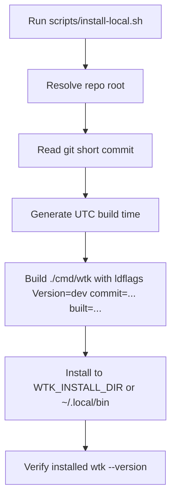

## Overview

### Problem Statement
- Release 链路已经建好，但本地开发时需要一种快速部署当前源码构建产物的方式。
- 本地开发版安装目标目录是 `~/.local/bin`，并通过 `wtk --version` 明确显示这是本地 build。

### Goals
- 提供快速本地部署当前 `wtk` 源码版本到 `~/.local/bin/wtk` 的路径。
- `wtk --version` 显示开发版标识、commit hash 和 build 时间。
- 开发版版本信息避免使用 release 版本号，降低与正式 release 的歧义。

### Scope
- 增加或调整本地安装/构建脚本。
- 复用现有 Go build `ldflags -X` 注入版本信息的机制。
- 保持 release 链路继续使用正式版本号。

### Success Criteria
- 运行本地安装脚本后，`~/.local/bin/wtk` 存在且可执行。
- `wtk --version` 输出类似 `wtk version dev commit=<hash> built=<time>`。
- 本地开发版输出中没有 semver/release 版本号。

## Research

### Existing System
- CLI 版本信息由 `internal/cli.Version` 变量提供，默认值是 `0.0.1`。Source: `internal/cli/root.go:19`
- Cobra root command 使用 `Version` 字段，因此 `wtk --version` 会显示该变量内容。Source: `internal/cli/root.go:48-52`
- release workflow 已经通过 Go linker flag 注入 `github.com/nettee/worktree-kit/internal/cli.Version=${version}`。Source: `.github/workflows/release.yml:23-30`
- 发布安装脚本默认安装目录是 `$HOME/.local/bin`。Source: `scripts/install.sh:20-23`
- 发布安装脚本会验证提取出的二进制 `--version` 输出包含 release version。Source: `scripts/install.sh:221-222`
- 现有安装脚本测试会验证安装后的 `wtk --version` 包含版本字符串。Source: `scripts/test-install.sh:52-56`

### Available Approaches
- **新增本地安装脚本**：创建开发专用脚本，直接 `go build` 到本地 bin 目录，并注入开发版版本字符串。Source: `.github/workflows/release.yml:29`, `scripts/install.sh:20-23`
- **修改发布安装脚本支持本地模式**：可复用现有安装脚本入口，但会让 release 下载/校验路径和本地源码 build 路径混在一起。Source: `scripts/install.sh:169-226`

### Constraints & Dependencies
- 开发版标识应使用 `dev`、commit hash、build time，避免 semver 形式。Source: conversation requirement
- 本地构建需要 `git` 读取 commit hash，并需要 `go build` 生成 `cmd/wtk`。Source: `go.mod:1-3`, `.github/workflows/release.yml:29`

## Design

### Architecture Overview


### Change Scope
- Add `scripts/install-local.sh` as the development install entrypoint. Impact: local developer workflow only. Source: `scripts/install.sh:20-23`, `.github/workflows/release.yml:29`
- Keep release workflow unchanged. Impact: tagged releases continue to inject release versions. Source: `.github/workflows/release.yml:23-30`

### Design Decisions
- Decision: Use a separate `scripts/install-local.sh` for source-based local builds. Source: `scripts/install.sh:169-226`
- Decision: Build `./cmd/wtk` directly with `go build -trimpath` and `-ldflags -X github.com/nettee/worktree-kit/internal/cli.Version=...`. Source: `.github/workflows/release.yml:29`, `internal/cli/root.go:19`
- Decision: Format local version as `dev commit=<short-hash> built=<utc-time>`. Source: conversation requirement, `internal/cli/root.go:51`
- Decision: Default install directory to `$HOME/.local/bin`, with `WTK_INSTALL_DIR` override for tests and custom installs. Source: `scripts/install.sh:20-23`
- Decision: Verify the installed binary by running `wtk --version` after installation. Source: `scripts/install.sh:221-222`, `scripts/test-install.sh:52-56`

### Why this design
- It reuses the proven release-time linker injection mechanism while isolating development install behavior from release download/checksum behavior.
- A `dev` prefix with commit and build time makes local binaries traceable without looking like a tagged release.

### Test Strategy
- Add a shell test for `scripts/install-local.sh` using a temporary `WTK_INSTALL_DIR`; assert the binary is executable and `--version` contains `dev commit=` and `built=`. Source: `scripts/test-install.sh:18-56`
- Run existing Go tests to verify CLI version behavior remains compatible. Source: `internal/cli/root_test.go:10-21`

### Pseudocode
```text
repo_root = parent directory of scripts/install-local.sh
install_dir = WTK_INSTALL_DIR or "$HOME/.local/bin"
commit = git -C repo_root rev-parse --short HEAD
build_time = date -u +%Y-%m-%dT%H:%M:%SZ
version = "dev commit=<commit> built=<build_time>"
mkdir -p install_dir
go build -trimpath -ldflags "-X github.com/nettee/worktree-kit/internal/cli.Version=<version>" -o install_dir/wtk repo_root/cmd/wtk
chmod 0755 install_dir/wtk
run install_dir/wtk --version
```

### File Structure
- `scripts/install-local.sh` - local source build and install script.
- `scripts/test-install-local.sh` - local install script smoke test.

## Plan

- [x] Step 1: Add local install script
  - [x] Substep 1.1 Implement: create `scripts/install-local.sh`
  - [x] Substep 1.2 Implement: inject `dev commit=<hash> built=<time>` through ldflags
  - [x] Substep 1.3 Verify: run the script with a temporary `WTK_INSTALL_DIR`
- [x] Step 2: Add regression coverage
  - [x] Substep 2.1 Implement: add shell smoke test for local install behavior
  - [x] Substep 2.2 Verify: run shell install tests and Go tests

## Notes

<!-- Optional sections — add what's relevant. -->

### Implementation

- `scripts/install-local.sh` - added source-based local installer that builds `cmd/wtk`, injects `dev commit=<hash> built=<utc-time>` through Go ldflags, installs to `WTK_INSTALL_DIR` or `$HOME/.local/bin`, and verifies the installed binary version.
- `scripts/test-install-local.sh` - added smoke coverage for syntax, temp-dir install, version output, installer output, and missing `go` fail-fast behavior.

### Verification

- `sh scripts/test-install-local.sh` - passed.
- `sh scripts/test-install.sh` - passed.
- `go test ./...` - passed.
