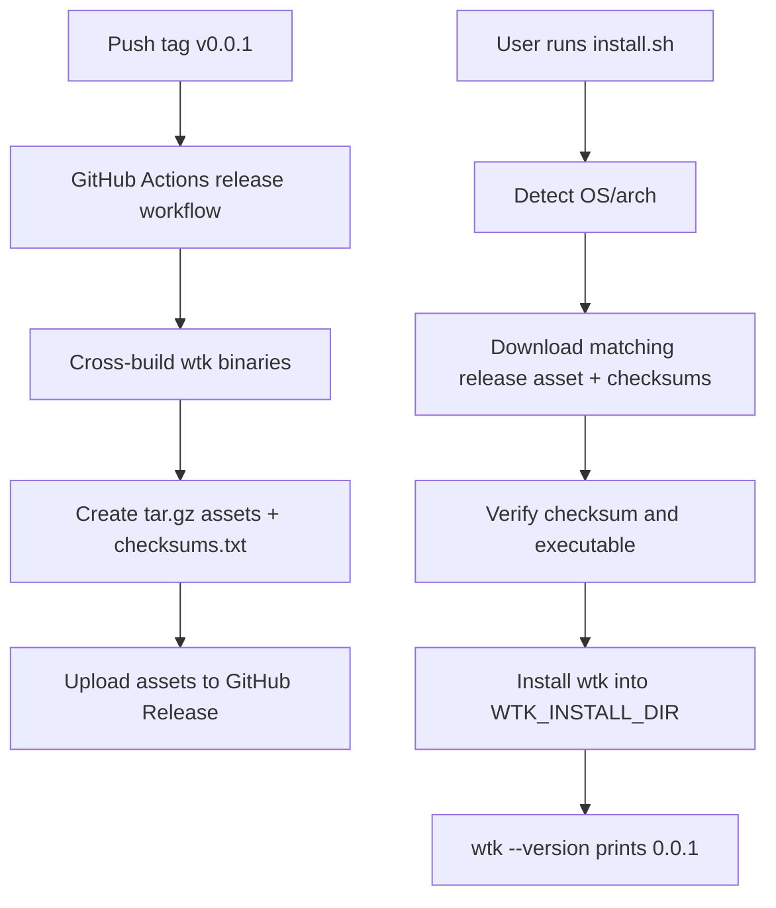

## Overview

### Problem Statement
- `worktree-kit` 的 one-click install 当前依赖 Go。
- one-click install 应改为依赖项目构建并发布的 release 产物。
- `wtk` 当前需要具备版本号，初始版本为 `0.0.1`。

### Goals
- 实现 `worktree-kit` 的 build 与 release 流程。
- 更新 one-click install，使安装流程使用 release 产物。
- 为 `wtk` 设置版本号 `0.0.1`。
- 支持通过 `wtk --version` 查看版本号。

### Success Criteria
- one-click install 可安装 release 产物，无需用户安装 Go。
- `wtk --version` 输出当前版本号 `0.0.1`。

## Research

### Existing System
- 当前 one-click installer 是 POSIX `sh` 脚本，使用 `set -eu` 和 `fail()` 进行 fail-fast 退出。Source: `scripts/install.sh:1-10`
- Installer 当前硬编码应用名 `wtk`、模块路径 `github.com/nettee/worktree-kit/cmd/wtk`，并要求 Go `1.25.0`。Source: `scripts/install.sh:4-6`
- Installer 当前预检 `go`、`grep`、`head`、`cut`、`basename`、`dirname`、`mkdir`，随后调用 `require_go_version`。Source: `scripts/install.sh:116-125`
- Installer 当前通过 `GOBIN=$install_dir go install "$install_target"` 安装二进制，因此用户机器必须具备 Go 工具链。Source: `scripts/install.sh:127-148`
- Installer 默认安装目录是 `${HOME}/.local/bin`，支持 `WTK_INSTALL_DIR` 覆盖。Source: `scripts/install.sh:53-55,127-134`
- Installer 成功后会检查目标目录是否在 `PATH`，并输出 profile 更新建议和 shell completion 示例。Source: `scripts/install.sh:152-167`
- Installer 测试当前用 `WTK_MODULE=./cmd/wtk` 和 `WTK_VERSION=""` 走本地 `go install` 路径，并断言安装后的 `wtk --help` 可执行。Source: `scripts/test-install.sh:26-40`
- Installer 测试当前明确断言缺少 `go` 时安装失败并输出 `missing required command: go`。Source: `scripts/test-install.sh:42-49`
- CI 当前只在 Ubuntu 上设置 Go `1.25.x`，运行 installer 测试和 `go test ./...`，没有 release job 或 artifact 上传步骤。Source: `.github/workflows/ci.yml:7-16`
- README 当前宣传 one-click install，但说明 installer 要求 Go `1.25` 或更新版本；同时保留 `go install` 安装方式。Source: `README.md:12-26`
- CLI 入口 `cmd/wtk/main.go` 只调用 `cli.Execute(context.Background(), os.Args[1:])`，错误时打印 stderr 并退出 1。Source: `cmd/wtk/main.go:11-15`
- Cobra root command 当前设置 `Use`、`Short`、`SilenceUsage`、`SilenceErrors`，并注册业务命令和 completion 命令；代码中没有版本字段或版本命令配置。Source: `internal/cli/root.go:23-34`
- 项目依赖 Cobra `v1.10.2`，适合通过 root command 处理 `--version` 一类 CLI 元信息。Source: `go.mod:5-9`

### Available Approaches
- **GitHub Actions + 手写 Go build/release**：现有 CI 已使用 GitHub Actions 和 `actions/setup-go`，可扩展为 tag/release workflow，执行跨平台 `go build`、打包、checksum 生成与 asset 上传。Source: `.github/workflows/ci.yml:7-16`; `https://github.com/actions/setup-go`
- **GitHub release 事件驱动上传**：GitHub Actions 支持 `release` 事件及 `published` 等 activity types，可用于 release 发布后构建或上传资产。Source: `https://docs.github.com/en/actions/using-workflows/events-that-trigger-workflows#release`
- **GitHub CLI 上传 release assets**：`gh release upload <tag> <files>...` 可向指定 tag 的 release 上传资产，支持 `--clobber` 覆盖同名资产。Source: `https://cli.github.com/manual/gh_release_upload`
- **GitHub REST Release Assets API**：可用 release `upload_url` 上传 raw binary asset；同名资产会返回 422。Source: `https://docs.github.com/en/rest/releases/assets#upload-a-release-asset`
- **GoReleaser**：`goreleaser/goreleaser-action` 支持在 tag workflow 中自动构建和发布多平台 Go CLI，需要 `GITHUB_TOKEN` 的 `contents: write` 权限。Source: `https://goreleaser.com/customization/ci/actions/`
- **Installer 下载 release artifact**：当前 installer 已具备安装目录选择、PATH 提示、安装后验证等结构，可把 `go install` 替换为平台检测、下载 release asset、校验、解压/安装、执行 `wtk --help` 或 `wtk --version` 验证。Source: `scripts/install.sh:127-167`
- **版本号注入**：当前 CLI root 构造点集中在 `internal/cli/root.go`，可在这里接收或设置版本信息，让 Cobra root 响应 `wtk --version`。Source: `internal/cli/root.go:23-34`

### Constraints & Dependencies
- one-click install 目标要求用户无需 Go，因此 installer 测试中“缺少 go 必须失败”的断言需要改为“缺少下载/解压/校验依赖时失败”。Source: `scripts/test-install.sh:42-49`
- 当前 `go.mod` 要求 Go `1.25.0`，构建流水线仍需要 Go 工具链，但该依赖应留在 CI/release 环境。Source: `go.mod:1-3`; `.github/workflows/ci.yml:11-16`
- Release installer 需要平台/架构映射，并需要明确 release asset 命名约定；当前脚本没有 OS/arch 检测逻辑。Source: `scripts/install.sh:116-148`
- Release installer 需要下载工具和校验工具预检；当前脚本预检的是 Go 安装路径所需工具。Source: `scripts/install.sh:116-123`
- README 安装说明需要同步移除 Go 依赖表述，并保留或重新定位 `go install` 作为开发者安装路径。Source: `README.md:12-26`
- 版本号初始值来自本 spec 需求，需要在构建产物和 `wtk --version` 输出之间保持一致。Source: `specs/change/20260511-one-click-install-release-version/spec.md:15-23`

### Key References
- `scripts/install.sh:116-148` - 当前 Go 依赖与 `go install` 安装路径。
- `scripts/install.sh:152-167` - 当前 PATH 提示、completion 提示、安装后指导可复用。
- `scripts/test-install.sh:26-49` - 当前 installer 行为测试覆盖本地安装、PATH、缺少 Go 失败。
- `.github/workflows/ci.yml:7-16` - 当前 CI workflow 基线。
- `internal/cli/root.go:23-34` - CLI root command 构造与版本能力接入点。
- `README.md:12-26` - 当前安装文档与 Go 依赖说明。

## Design

### Architecture Overview

### Change Scope
- Area: CLI version metadata. Impact: add a single version source in Go code, wire it into Cobra root, and make `wtk --version` print `0.0.1`. Source: `internal/cli/root.go:23-34`; `go.mod:5-9`; `specs/change/20260511-one-click-install-release-version/spec.md:15-23`
- Area: Build/release automation. Impact: add a GitHub Actions release workflow that builds release assets and uploads them to GitHub Releases. Source: `.github/workflows/ci.yml:7-16`; `https://docs.github.com/en/actions/using-workflows/events-that-trigger-workflows#release`; `https://cli.github.com/manual/gh_release_upload`
- Area: Installer. Impact: replace the `go install` path with release asset download, checksum verification, install-dir placement, PATH guidance, and installed binary verification. Source: `scripts/install.sh:116-167`
- Area: Installer tests. Impact: update tests around local fixture assets/download overrides and dependency failures for release-based install. Source: `scripts/test-install.sh:26-49`
- Area: Documentation. Impact: update README install text to describe release artifact install and keep `go install` as a developer path. Source: `README.md:12-26`

### Design Decisions
- Decision: Use a hand-written GitHub Actions release workflow for this iteration, triggered by version tags `v*`, with `contents: write` permission and `gh release upload` for assets. Source: `.github/workflows/ci.yml:7-16`; `https://cli.github.com/manual/gh_release_upload`; `https://docs.github.com/en/actions/using-workflows/events-that-trigger-workflows#release`
- Decision: Build POSIX one-click install assets for `darwin` and `linux` on `amd64` and `arm64`; the shell installer maps `uname -s` and `uname -m` to those asset names. Source: `scripts/install.sh:116-148`; `scripts/install.sh:1-2`
- Decision: Use asset names `wtk_${version}_${os}_${arch}.tar.gz` plus `checksums.txt`, where release tags use `v0.0.1` and asset version strings use `0.0.1`. Source: `specs/change/20260511-one-click-install-release-version/spec.md:15-23`; `https://cli.github.com/manual/gh_release_upload`
- Decision: Keep release downloads simple with GitHub release download URLs: `latest/download` by default and `download/v${version}` when `WTK_VERSION` is set. Source: `README.md:17`; `scripts/install.sh:127-129`
- Decision: Keep installer environment overrides for testability and user control: `WTK_INSTALL_DIR`, `WTK_VERSION`, `WTK_REPO`, and add `WTK_DOWNLOAD_BASE_URL` for local fixture tests. Source: `scripts/install.sh:127-129`; `scripts/test-install.sh:32-40`
- Decision: Validate downloads with `checksums.txt` before installing; fail immediately on missing dependency, unsupported platform, download failure, checksum mismatch, missing binary, or failed `wtk --version`. Source: `scripts/install.sh:8-10,145-148`; `https://docs.github.com/en/rest/releases/assets#upload-a-release-asset`
- Decision: Set `Version: Version` on the Cobra root command and keep `Version` as a package-level variable defaulting to `0.0.1`, so `go build -ldflags "-X ...Version=${version}"` can override it during release. Source: `internal/cli/root.go:23-34`; `go.mod:5-9`
- Decision: Verify installed binaries with `wtk --version` and expect `0.0.1`, aligning installer success with the new user-visible version requirement. Source: `scripts/install.sh:145-148`; `specs/change/20260511-one-click-install-release-version/spec.md:21-23`

### Why this design
- A hand-written workflow fits the current small repo and keeps release behavior visible in one YAML file.
- Release assets move Go from the end-user machine into CI, matching the one-click install goal.
- Checksum verification and fail-fast installer checks preserve the repository's current observable failure style.
- A package-level version variable gives a stable default for local builds and supports tag-time ldflags injection.

### Test Strategy
- CLI: add/extend Go tests for `wtk --version` output through the root command. Source: `internal/cli/root.go:23-34`; `go.mod:5-9`
- Build: add a script or workflow step that builds release assets for the supported OS/arch matrix and generates `checksums.txt`. Source: `.github/workflows/ci.yml:7-16`
- Installer: update `scripts/test-install.sh` to create local fixture tarballs and `checksums.txt`, run installer with `WTK_DOWNLOAD_BASE_URL`, then assert installed `wtk --version` prints `0.0.1`. Source: `scripts/test-install.sh:26-40`
- Failure paths: cover unsupported platform mapping, missing download/checksum dependency, missing asset, and checksum mismatch with non-zero exits. Source: `scripts/install.sh:8-10`; `scripts/test-install.sh:42-49`
- Docs: verify README one-click install section describes release artifact install and version check. Source: `README.md:12-26`

### Pseudocode
Release workflow:
  1. Trigger on `push` tags matching `v*`.
  2. Set `version=${GITHUB_REF_NAME#v}`.
  3. For each supported `GOOS/GOARCH`, run `go build -trimpath -ldflags "-s -w -X github.com/nettee/worktree-kit/internal/cli.Version=${version}" -o dist/wtk ./cmd/wtk`.
  4. Package each binary as `wtk_${version}_${os}_${arch}.tar.gz`.
  5. Generate `checksums.txt` for packaged assets.
  6. Upload assets to the release for the tag.

Installer:
  1. Require `curl`, `tar`, `mktemp`, `uname`, `chmod`, `mkdir`, `basename`, `dirname`, and one checksum tool.
  2. Resolve install dir from `WTK_INSTALL_DIR` or `$HOME/.local/bin`.
  3. Resolve version from `WTK_VERSION` or `latest`.
  4. Detect `os` and `arch`; fail on unsupported combinations.
  5. Download tarball and `checksums.txt` from GitHub or `WTK_DOWNLOAD_BASE_URL`.
  6. Verify checksum.
  7. Extract `wtk`, install executable to `$install_dir/wtk`.
  8. Run `$install_dir/wtk --version`; require expected version for pinned installs and non-empty output for latest.
  9. Print PATH and completion guidance.

### Interfaces / APIs
- CLI: `wtk --version` outputs `wtk version 0.0.1` or Cobra's equivalent version line.
- Installer env:
  - `WTK_INSTALL_DIR`: target directory, default `$HOME/.local/bin`.
  - `WTK_VERSION`: version without `v`, default latest release.
  - `WTK_REPO`: GitHub repo, default `nettee/worktree-kit`.
  - `WTK_DOWNLOAD_BASE_URL`: test/development override for asset downloads.
- Release assets:
  - `wtk_0.0.1_darwin_amd64.tar.gz`
  - `wtk_0.0.1_darwin_arm64.tar.gz`
  - `wtk_0.0.1_linux_amd64.tar.gz`
  - `wtk_0.0.1_linux_arm64.tar.gz`
  - `checksums.txt`

### Edge Cases
- Unsupported OS/arch exits with a clear `unsupported platform` error.
- Missing `HOME` with no `WTK_INSTALL_DIR` exits before download.
- Missing required command exits before network calls.
- Download failure exits with the asset URL in the diagnostic.
- Checksum mismatch exits before install-dir mutation.
- Existing `wtk` is overwritten only after a verified asset is extracted.
- Latest installs verify that `wtk --version` returns output; pinned installs verify the requested version string.

### File Structure
- `internal/cli/root.go` - add version metadata and Cobra version wiring.
- `cmd/wtk/main.go` - keep current CLI entrypoint unless version injection requires main-package relocation.
- `.github/workflows/release.yml` - build, package, checksum, upload release assets.
- `scripts/install.sh` - download and install release assets.
- `scripts/test-install.sh` - fixture-based installer tests.
- `README.md` - install and version documentation.

## Plan

- [x] Step 1: CLI version support
  - [x] Substep 1.1 Implement: add `Version = "0.0.1"` and wire it into Cobra root.
  - [x] Substep 1.2 Implement: expose version injection path for release ldflags.
  - [x] Substep 1.3 Verify: add/run Go test for `wtk --version`.
- [x] Step 2: Release artifact pipeline
  - [x] Substep 2.1 Implement: add release workflow triggered by `v*` tags.
  - [x] Substep 2.2 Implement: cross-build supported OS/arch binaries with version ldflags.
  - [x] Substep 2.3 Implement: package tar.gz assets and generate `checksums.txt`.
  - [x] Substep 2.4 Implement: upload assets with `gh release upload`.
  - [x] Substep 2.5 Verify: run local build/package script or workflow-equivalent commands where practical.
- [x] Step 3: Release-based installer
  - [x] Substep 3.1 Implement: replace Go preflight and `go install` with platform detection, download, checksum, extraction, and install.
  - [x] Substep 3.2 Implement: preserve install dir, PATH, profile update, and completion guidance behavior.
  - [x] Substep 3.3 Implement: add `WTK_REPO`, `WTK_VERSION`, and `WTK_DOWNLOAD_BASE_URL` handling.
  - [x] Substep 3.4 Verify: update installer tests with local fixture assets and version assertions.
  - [x] Substep 3.5 Verify: cover missing dependency, unsupported platform, and checksum mismatch failures.
- [x] Step 4: Documentation and full validation
  - [x] Substep 4.1 Implement: update README install, release, and version notes.
  - [x] Substep 4.2 Verify: run `sh scripts/test-install.sh`.
  - [x] Substep 4.3 Verify: run `go test ./...`.
  - [x] Substep 4.4 Verify: build a release-style binary and run `wtk --version`.

## Notes

<!-- Optional sections — add what's relevant. -->

### Implementation

- `internal/cli/root.go` - added package-level `Version = "0.0.1"` and wired Cobra version output.
- `internal/cli/root_test.go` - added `--version` coverage.
- `.github/workflows/release.yml` - added tag-triggered release workflow that cross-builds darwin/linux amd64/arm64 tarballs, generates `checksums.txt`, and creates or updates the GitHub Release assets.
- `scripts/install.sh` - replaced Go install flow with release asset download, OS/arch detection, checksum verification, temp-binary version verification before install, install-dir placement, PATH guidance, and completion guidance.
- `scripts/test-install.sh` - added local release fixture install test plus missing dependency, unsupported OS, and checksum mismatch failure coverage.
- `README.md` - updated install docs for release assets, pinned version installs, developer `go install`, and `wtk --version`.

### Verification

- `sh scripts/test-install.sh` - passed.
- `go test ./...` - passed.
- Local release workflow equivalent cross-build/package/checksum loop for darwin/linux amd64/arm64 - passed.
- Release-style local binary with ldflags version injection ran `wtk --version` and printed `wtk version 0.0.1`.
- Oracle review findings were addressed before final validation.
