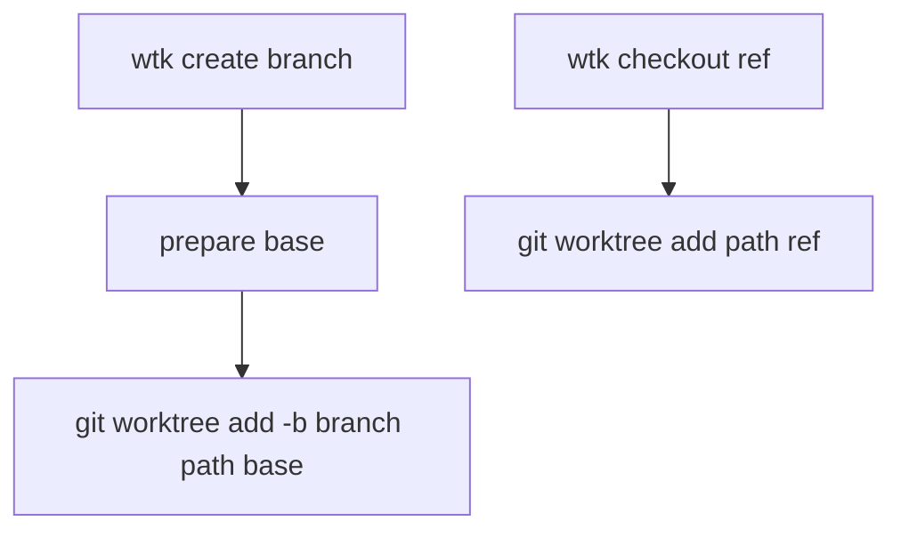

## Overview

`wtk create` currently uses `--new` to distinguish creating a new branch from checking out an existing branch into a worktree. The desired breaking change is to make command names carry that distinction:

- `wtk create <branch>` creates a new branch and worktree.
- `wtk checkout <branch>` creates a worktree from an existing branch or ref.

Compatibility with the old `wtk create <branch> --new` and `wtk create <existing-branch>` forms is intentionally out of scope.

## Research

### Existing System

- `wtk create <branch>` currently accepts `--path`, `--base`, `--new`, and `--no-clipboard`; `--base` is described as "base branch for --new". Source: `internal/cli/create.go:8-24`
- The CLI registers `create`, `remove`, `send-out`, `bring-in`, and `completion` as top-level commands. Source: `internal/cli/root.go:50-60`
- `Service.Create` currently branches on `opts.New`: new-branch mode runs `git worktree add -b <branch> <path> <base>`, existing-ref mode runs `git worktree add <path> <branch>`. Source: `internal/worktree/service.go:31-63`
- README examples document both old forms: `wtk create feature/foo --new` and `wtk create feature/existing`. Source: `README.md:40-50`
- E2E coverage currently exercises `create ... --new`, existing-branch `create`, default-base fetch/update behavior, non-fast-forward refusal, and usage errors for `wtk create <branch> [flags]`. Source: `test/e2e/wtk_test.go:55-79,94-126,128-166,179-203`
- The original CLI spec defined `wtk create <branch> [--path <path>] [--base <branch>] [--new] [--no-clipboard]`, with existing-ref and new-branch behavior behind the same command. Source: `specs/change/20260510-worktree-kit-cli/spec.md:147-155`

### Available Approaches

- **Breaking split**: make `create` always create a new branch and add `checkout` for existing branch/ref worktrees. Source: conversation decision; current implementation split point in `internal/worktree/service.go:48-58`
- **Compatibility period**: retain old `--new` and old existing-branch `create` behavior with warnings. Rejected by user; compatibility is out of scope. Source: conversation decision

### Constraints & Dependencies

- New-branch creation must keep the existing default-base preparation behavior, including fetch/update and non-fast-forward refusal. Source: `internal/worktree/service.go:50-55`, `test/e2e/wtk_test.go:94-166`
- Existing branch/ref worktree creation still needs default path handling and clipboard behavior shared with create. Source: `internal/worktree/service.go:40-47,56-63`
- Usage errors need command-specific usage strings because existing tests assert usage output. Source: `test/e2e/wtk_test.go:179-203`

## Design

### Architecture Overview

### Change Scope

- Area: CLI command surface. Impact: remove `--new` from `create`, add top-level `checkout`. Source: `internal/cli/create.go:8-24`, `internal/cli/root.go:50-60`
- Area: worktree service API. Impact: separate new-branch and existing-ref flows while preserving shared path and completion behavior. Source: `internal/worktree/service.go:31-63`
- Area: docs and tests. Impact: update README usage and E2E expectations for the breaking command split. Source: `README.md:40-50`, `test/e2e/wtk_test.go:55-203`

### Design Decisions

- Decision: `wtk create <branch>` always creates a new branch and worktree using `git worktree add -b <branch> <path> <base>`. Source: `internal/worktree/service.go:50-55`
- Decision: `wtk checkout <branch>` creates a worktree from an existing branch/ref using `git worktree add <path> <branch>`. Source: `internal/worktree/service.go:56-58`
- Decision: remove the `--new` flag and update `--base` help to describe `create` directly. Source: `internal/cli/create.go:20-23`
- Decision: keep `--base` only on `create`; `checkout` accepts `--path` and `--no-clipboard`. Source: `internal/cli/create.go:20-23`, `internal/worktree/service.go:48-58`
- Decision: register `checkout` as a top-level command next to existing commands. Source: `internal/cli/root.go:60`
- Decision: update usage-error tests so `create` and `checkout` each validate missing/extra branch arguments and unknown flags against their own usage strings. Source: `test/e2e/wtk_test.go:179-203`

### Why this design

- Command names encode user intent directly: `create` means new branch, `checkout` means existing ref.
- The service already contains the required two execution paths, so the implementation can split the public API around existing behavior.
- Direct breaking change keeps the command surface clean and avoids warning/deprecation paths.

### Test Strategy

- Update E2E tests that currently call `create ... --new` to call `create ...`. Validation: linked worktree exists and default-base fetch/update behavior still works. Source: `test/e2e/wtk_test.go:55-63,94-126`
- Update existing-branch worktree tests to call `checkout <branch>`. Validation: dirty linked worktree failures still use a linked worktree created from an existing branch. Source: `test/e2e/wtk_test.go:75-91`
- Add or update usage-error tests for `checkout` missing branch, too many args, and unknown flags. Validation: output includes `wtk checkout <branch> [flags]`. Source: `test/e2e/wtk_test.go:179-203`
- Run the Go test suite after implementation. Source: current tests in `test/e2e/wtk_test.go`, `internal/worktree/service_test.go`

### Pseudocode

Flow:
  create command:
    parse branch, path, base, no-clipboard
    call CreateNewBranch
    prepare base
    run git worktree add -b branch path base

  checkout command:
    parse branch/ref, path, no-clipboard
    call CheckoutExistingRef
    run git worktree add path branch

### File Structure

- `internal/cli/create.go` - make `create` the new-branch command and remove `--new`.
- `internal/cli/checkout.go` - add existing-ref worktree command.
- `internal/cli/root.go` - register `checkout`.
- `internal/worktree/service.go` - expose separate service methods or split helper functions for create-new and checkout-existing behavior.
- `test/e2e/wtk_test.go` - update command invocations and usage tests.
- `README.md` - document the new command split.

## Plan

- [x] Step 1: Split service and CLI commands
  - [x] Substep 1.1 Implement: make `create` call the new-branch path by default.
  - [x] Substep 1.2 Implement: add `checkout` for existing branch/ref worktree creation.
  - [x] Substep 1.3 Implement: remove `--new` from the CLI surface.
  - [x] Substep 1.4 Verify: run focused command-help and argument-error checks.
- [x] Step 2: Update tests and documentation
  - [x] Substep 2.1 Implement: update E2E tests from `create --new` to `create`.
  - [x] Substep 2.2 Implement: update existing-ref tests to use `checkout`.
  - [x] Substep 2.3 Implement: update README examples and command descriptions.
  - [x] Substep 2.4 Verify: run the Go test suite.

## Notes

<!-- Optional sections — add what's relevant. -->

### Implementation

- `internal/worktree/service.go` - `Create` now always runs the new-branch worktree flow and `Checkout` handles existing branch/ref worktrees.
- `internal/cli/create.go` - removed `--new` and updated command help for new-branch creation.
- `internal/cli/checkout.go` - added `wtk checkout <branch>` with `--path` and `--no-clipboard`.
- `internal/cli/root.go` - registered `checkout` as a top-level command.
- `test/e2e/wtk_test.go` - updated create calls, existing-ref worktree coverage, and checkout usage-error coverage.
- `README.md` - documented the create/checkout command split.

### Verification

- Ran `gofmt` on modified Go files.
- Ran `go test ./...` successfully.
