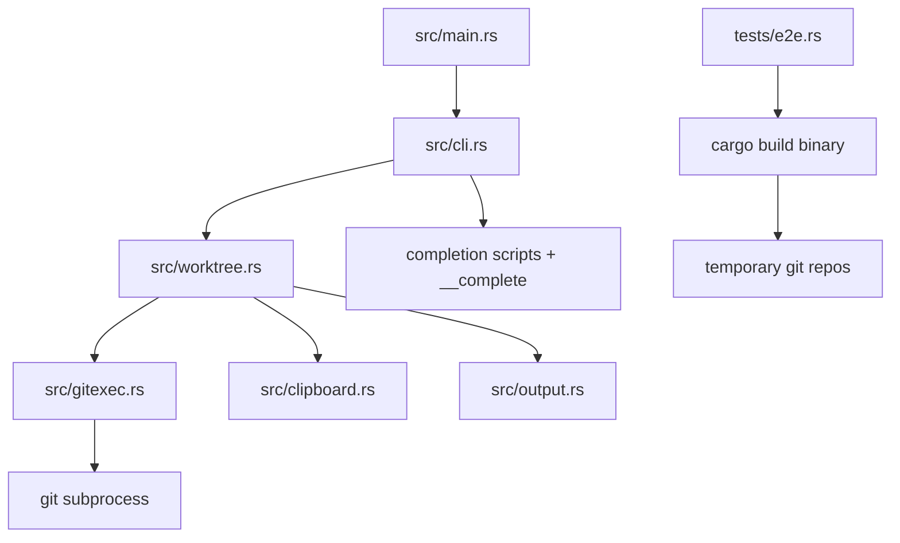

## Overview

把当前 Go 实现的 `wtk` 全量迁移到 Rust，同时保持现有 CLI 行为、安装与发布链路、文档和测试覆盖。迁移完成后仓库内不再保留 Go 源码，并补齐真实二进制驱动的 e2e 测试，确保用户继续通过 release、one-click install 和本地 install 使用 `wtk`。

## Research

### Existing System

- 当前 README 把 `wtk` 描述为 5 个业务命令加 1 个补全命令：`create`、`checkout`、`remove`、`send-out`、`bring-in`，以及 `completion`。Source: `README.md:3-10,70-77`
- 历史规格把 worktree 领域模型定义为 4 个核心操作：`create`、`remove`、`send-out`、`bring-in`；`checkout` 是后续拆分 `create` 时新增的 CLI 命令。Source: `specs/change/20260510-worktree-kit-cli/spec.md:12-18,28-31`; `specs/change/20260511-split-create-checkout-commands/spec.md:8-18,31-39`
- 当前 CLI 根命令通过 Cobra 组装，注册了 `create`、`checkout`、`remove`、`send-out`、`bring-in`、`completion` 六个子命令，并通过 `Version` 暴露 `--version`。Source: `internal/cli/root.go:19-22,46-63`
- 参数校验、usage error 输出和动态 completion 也都在 CLI 层完成；错误会带具体 usage 文本返回到 stderr。Source: `internal/cli/root.go:25-39,70-143,152-239`
- worktree 业务逻辑集中在 `internal/worktree/service.go`，当前已经把 `create` 和 `checkout` 区分为两个入口，其他操作为 `remove`、`send-out`、`bring-in`。Source: `internal/worktree/service.go:16-29,31-217`
- `create` 默认创建新分支 linked worktree，支持 `--base` 与 `--from-current`；`checkout` 则把已有 branch/ref checkout 到 linked worktree。Source: `internal/worktree/service.go:31-84`; `README.md:44-49,54-68`
- `remove` 支持在 linked worktree 中省略路径，支持 `--delete-branch`，并在删除 worktree 后按需删除分支。Source: `internal/worktree/service.go:86-124`
- `send-out` 只能在 main worktree 运行，要求工作区干净，先切到 base branch，再把当前任务分支移到 linked worktree。Source: `internal/worktree/service.go:126-174`
- `bring-in` 只能在 main worktree 运行，要求 main 和目标 linked worktree 都干净，删除 linked worktree 后切回对应 branch。Source: `internal/worktree/service.go:176-217`
- main branch 解析优先级为显式 `--base`、`git config worktree-kit.mainBranch`、`origin/HEAD`、以及 `main/master/trunk/develop` 中唯一匹配项；无法判定时直接失败。Source: `internal/worktree/service.go:238-324`; `README.md:54-68`
- 默认 linked worktree 目录命名规则是 sibling directory `<repo>-wt-<branch-slug>`。Source: `internal/worktree/paths.go:8-24`; `README.md:11`
- 当前实现遵守 fail-fast：dirty worktree、main branch 歧义、Git 上下文缺失、Git 命令失败、剪贴板失败都会直接暴露；若 Git 成功但剪贴板失败，会以非零退出暴露 partial failure。Source: `internal/worktree/service.go:227-365`; `README.md:79-81`; `internal/worktree/service_test.go:14-36`

### Design Inputs

- 仓库自身的 AGENTS 约束明确要求 observable failure：缺失输入、配置、文件、命令或依赖时应立即失败，不允许 mock、placeholder、broad catch 或 best-effort continuation。Source: `AGENTS.md`
- 当前实现把 Git 调用封装为单一 `Runner` 接口，并把 stderr/stdout/exit code 包装成结构化错误，便于把失败向上传播。Source: `internal/gitexec/git.go:11-46`
- 仓库上下文解析依赖真实 `git rev-parse` 与 `git worktree list --porcelain`，并以 main worktree 为路径与状态判断基准。Source: `internal/gitexec/repo.go:17-64`
- 输出层只负责渲染 git 命令、成功、警告和提示，不承担恢复逻辑。Source: `internal/output/output.go:1-21`
- 当前 release workflow 在 GitHub Actions 上交叉构建 `darwin/linux` x `amd64/arm64` 四个平台 tarball，并生成 `checksums.txt` 后上传到 GitHub Release。Source: `.github/workflows/release.yml:1-43`
- 当前 CI 在 Ubuntu 上跑 installer 测试、本地 install 测试和全部 Go 测试。Source: `.github/workflows/ci.yml:1-17`
- one-click installer 当前从 GitHub Release 下载 `wtk_${version}_${os}_${arch}.tar.gz`，校验 SHA256，安装到 `${WTK_INSTALL_DIR:-$HOME/.local/bin}`，然后验证 `wtk --version`。Source: `scripts/install.sh:1-239`; `README.md:13-39`
- 本地 install 脚本当前直接从源码构建，并把版本写成 `dev commit=<hash> built=<time>`。Source: `scripts/install-local.sh:1-49`
- shell installer 已有本地 fixture 测试，覆盖成功安装、PATH 提示、缺少依赖、unsupported platform、checksum mismatch 和缺少 Go 的本地 install 失败。Source: `scripts/test-install.sh:1-85`; `scripts/test-install-local.sh:1-44`

### Constraints & Dependencies

- 用户要求重写完成后仓库中不再保留 Go 代码，因此现有 `cmd/`, `internal/`, `go.mod`, `go.sum` 和 Go 测试都需要迁移或删除，而不是长期双栈共存。Source: user requirement; repository root listing
- 用户要求 e2e 测试必须基于真实 CLI 打包产物，并在临时 Git 仓库中执行；当前 e2e 已经采用“先 build 二进制，再在临时 repo 中运行”的模式，可迁移到 Rust。Source: `test/e2e/wtk_test.go:12-339`
- 用户要求 release、install 脚本和本地 install 功能继续存在，因此 Rust 重写后仍需保留等价的 release asset 命名、安装变量和验证行为。Source: user requirement; `scripts/install.sh:1-239`; `scripts/install-local.sh:1-49`
- 当前 README 仍然把开发者安装方式写成 `go install`，Rust 迁移后文档必须改写为新的开发与本地安装路径。Source: `README.md:29-33`
- Cargo 在当前环境可用，可以作为 Rust 工具链入口。Source: local command `cargo --version` on 2026-05-22

### Key References

- `internal/cli/root.go:19-239` - CLI 装配、usage error、completion、`--version`
- `internal/worktree/service.go:31-365` - 五个业务命令的主流程、main branch 解析、dirty 检查、clipboard partial failure
- `internal/gitexec/repo.go:17-64` - Git 仓库上下文解析
- `test/e2e/wtk_test.go:12-339` - 真实二进制驱动的 e2e 结构与覆盖面
- `scripts/install.sh:1-239` - release installer 行为与环境变量契约
- `scripts/install-local.sh:1-49` - 本地 install 行为与 dev version 约定
- `.github/workflows/ci.yml:1-17` - 当前 CI 验证面
- `.github/workflows/release.yml:1-43` - 当前 release 产物矩阵与命名

## Design

### Design Summary

- 用单一 Rust crate 重建 `wtk`，把当前 Go 代码里的三层结构保持为等价的 Rust 模块：CLI 解析层、Git/仓库上下文层、worktree 服务层。这样可以在迁移时直接对照现有行为和 e2e 覆盖，不重新发明产品语义。
- CLI 行为默认保持当前仓库已经发布出来的用户界面：4 个核心 worktree 操作 `create`、`remove`、`send-out`、`bring-in`，再保留当前已存在的 `checkout` 子命令，以及 `completion` 和 `--version`。这样既符合历史“四个操作”模型，也兼容当前 README、测试和安装产物所暴露的命令集。
- completion 不依赖第三方框架的动态补全能力，而是由 `wtk completion <shell>` 生成脚本，并由一个隐藏的 `__complete` 子命令提供运行时 branch/path 候选，等价替代当前 Cobra 动态补全。
- 测试分三层迁移：小型单元测试覆盖 slug、repo 解析和错误边界；CLI/usage 测试覆盖参数与输出；e2e 测试继续用“先构建真实二进制，再在临时 Git 仓库执行”的方式验证真实行为。
- 发布和安装链路保持现有外部契约不变：release asset 仍命名为 `wtk_${version}_${os}_${arch}.tar.gz`，installer 继续消费同名产物和 `checksums.txt`，本地 install 继续注入 `dev commit=<hash> built=<time>` 版本字符串。

### Design Decisions

- Decision: 使用 Rust `clap` 构建顶层命令解析、flag 解析和 `--version` 输出，但 completion 子系统自行实现为 `completion` + 隐藏 `__complete`，以保留当前动态 branch/worktree completion 行为。Source: `internal/cli/root.go:46-63,152-239`; `test/e2e/wtk_test.go:50-63,325-339`
- Decision: 保留当前用户可见命令面 `create`、`checkout`、`remove`、`send-out`、`bring-in`、`completion`，把“四个命令”解释为领域核心操作，而不是删除已经发布的 `checkout`。Source: `README.md:3-10,41-77`; `specs/change/20260510-worktree-kit-cli/spec.md:12-18`; `specs/change/20260511-split-create-checkout-commands/spec.md:8-18`
- Decision: Rust 代码结构映射现有 Go 分层，至少拆为 `cli`、`gitexec`、`worktree`、`output`、`clipboard` 五个模块，降低行为回归风险。Source: `internal/cli/root.go:13-17`; `internal/worktree/service.go:11-29`; `internal/gitexec/git.go:11-46`; `internal/output/output.go:1-21`
- Decision: Git 命令执行继续使用真实 subprocess，并保留结构化 stderr/stdout/exit code 错误对象，确保 fail-fast 和可诊断性不被“更温和”的错误处理稀释。Source: `AGENTS.md`; `internal/gitexec/git.go:11-46`
- Decision: repo 上下文解析继续以 `git rev-parse --show-toplevel`、`git rev-parse --git-common-dir` 和 `git worktree list --porcelain` 为准，不用扫描 `.git` 目录或自行猜测。Source: `internal/gitexec/repo.go:22-39`
- Decision: `create`、`checkout`、`remove`、`send-out`、`bring-in` 的 Git 操作顺序、默认路径规则、main branch 探测优先级、dirty 检查和 clipboard partial failure 行为保持与现实现有测试一致。 Source: `internal/worktree/service.go:31-365`; `internal/worktree/paths.go:8-24`; `README.md:52-81`; `test/e2e/wtk_test.go:12-245`
- Decision: 安装脚本外部接口保持不变，继续支持 `WTK_INSTALL_DIR`、`WTK_VERSION`、`WTK_REPO`、`WTK_DOWNLOAD_BASE_URL` 和 `WTK_SKIP_PATH_UPDATE`，仅把内部构建与 release 来源从 Go 切换到 Rust 产物。 Source: `scripts/install.sh:1-239`
- Decision: 本地 install 继续是独立脚本 `scripts/install-local.sh`，通过编译时环境变量注入 `dev commit=<hash> built=<time>` 版本串，而不是混入 release installer 的逻辑分支。 Source: `scripts/install-local.sh:1-49`; `specs/change/20260511-local-dev-install/spec.md:63-90`
- Decision: e2e 测试改成 Rust integration tests，在测试启动时执行真实 release/debug CLI build，然后在每个 case 的临时 Git 仓库里运行该二进制。Source: `test/e2e/wtk_test.go:12-339`
- Decision: 完成迁移后删除全部 Go 源码与 Go module 文件，并把 CI 从 `go test` 切换为 `cargo test`、shell installer tests 和必要的格式/编译检查。Source: user requirement; `.github/workflows/ci.yml:1-17`

### System Structure

### System Procedure

Flow:
  1. `main` 调用 CLI parser，得到具体子命令和选项。
  2. CLI 层把参数映射到 `worktree::Options` 或 completion 请求。
  3. `worktree::Service` 先解析 repo 上下文、校验 dirty/main branch/path 等前置条件。
  4. Service 逐步输出将要执行的 `git -C ...` 命令，再调用 `gitexec` 执行。
  5. 成功后输出 success 文本，并按默认行为复制 path/branch 到 clipboard。
  6. 若 clipboard 失败，则保留成功输出并返回非零错误。

### Interfaces / APIs

- Binary name: `wtk`
- Visible commands:
  - `wtk create <branch> [--path <path>] [--base <branch>] [--from-current|-C] [--no-clipboard]`
  - `wtk checkout <branch> [--path <path>] [--no-clipboard]`
  - `wtk remove [path] [--delete-branch] [--no-clipboard]`
  - `wtk send-out [--path <path>] [--base <branch>] [--no-clipboard]`
  - `wtk bring-in <branch> [--no-clipboard]`
  - `wtk completion <bash|zsh|fish|powershell>`
  - hidden: `wtk __complete ...`
- Compile-time version interface:
  - release builds set `WTK_VERSION=<semver>`
  - local install sets `WTK_VERSION="dev commit=<hash> built=<time>"`
  - default source build falls back to `0.0.1`

### Change Scope

- Impact Areas:
  - CLI command surface and argument validation
  - Git worktree orchestration logic
  - Dynamic completion generation
  - Version injection and binary metadata
  - Release packaging and installer scripts
  - CI and automated test execution
  - README and spec documentation
- Planned File Changes:
  - `Cargo.toml` - define the Rust crate, dependencies, package metadata, and test targets
  - `Cargo.lock` - Rust dependency lockfile
  - `src/main.rs` - program entrypoint and exit behavior
  - `src/cli.rs` - command parsing, usage formatting, completion command handling
  - `src/gitexec.rs` - subprocess wrapper and repo context parsing
  - `src/worktree.rs` - core worktree workflows and validations
  - `src/output.rs` - terminal rendering helpers
  - `src/clipboard.rs` - clipboard abstraction and no-op mode
  - `src/paths.rs` or equivalent - branch slugging and default linked worktree path logic
  - `tests/e2e.rs` - real-binary end-to-end coverage
  - `tests/*.rs` - targeted unit/integration tests for parsing and service behavior
  - `scripts/install.sh` - switch local verification assumptions from Go to Rust builds while preserving release contract
  - `scripts/install-local.sh` - build/install the Rust binary with dev version metadata
  - `scripts/test-install.sh` - validate release installer against Rust fixture binaries
  - `scripts/test-install-local.sh` - validate local Rust install behavior
  - `.github/workflows/ci.yml` - run Rust and shell test suite
  - `.github/workflows/release.yml` - package Rust release assets
  - `README.md` - update install, build, usage, and development instructions
  - remove `cmd/`, `internal/`, `go.mod`, `go.sum`, and Go test files after Rust parity is achieved

### Edge Cases

- Git 仓库外执行命令时必须直接失败，并带清晰诊断。
- `create --base` 与 `--from-current` 同时出现时必须直接失败。
- `send-out` 从非 main worktree 运行时必须失败。
- `remove` 在 main worktree 省略路径时必须失败。
- `bring-in` 指向未在 linked worktree 中 checkout 的 branch 时必须失败。
- main branch 探测到多个候选时必须失败，不自动猜测。
- `create` 默认 base 更新若遇到 non-fast-forward，必须按现有行为拒绝推进。
- 成功 Git 操作后的 clipboard 失败必须仍然导致非零退出。
- completion 在非 Git 环境下应返回空候选而不是报错污染 shell。

### Verification Strategy

- CLI/usage: 通过 Rust tests 验证缺参、多参、unknown flag、unsupported shell、`--version` 输出和 stdout/stderr 分流。 Source: `internal/cli/root.go:25-39,101-143`; `internal/cli/root_test.go:1-19`; `test/e2e/wtk_test.go:218-323`
- Core service: 通过单元测试验证 main branch 探测、clipboard partial failure、worktree list 解析、slug/path 规则。 Source: `internal/worktree/service_test.go:14-36`; `internal/gitexec/repo_test.go:1-15`; `internal/worktree/paths.go:8-24`
- E2E: 迁移当前真实二进制测试场景，包括 `checkout/remove`、`send-out/bring-in`、`create --from-current`、dirty failures、fast-forward base、non-fast-forward refusal、completion、usage errors。 Source: `test/e2e/wtk_test.go:12-245`
- Installer tests: 保留并更新 `scripts/test-install.sh` 与 `scripts/test-install-local.sh`，验证 release installer、本地 installer 和失败路径。 Source: `scripts/test-install.sh:1-85`; `scripts/test-install-local.sh:1-44`
- CI: 运行 shell installer tests + `cargo test`，并保证仓库已无 Go 代码依赖。 Source: `.github/workflows/ci.yml:1-17`

## Plan

- [x] Step 1: 建立 Rust CLI 和基础模块骨架
  - [x] Substep 1.1 Implement: 新建 Cargo crate、入口、版本注入和基础模块结构
  - [x] Substep 1.2 Implement: 迁移 CLI 解析、usage error、`--version` 和输出渲染
  - [x] Substep 1.3 Implement: 迁移 branch slug、默认路径和 Git subprocess 包装
  - [x] Substep 1.4 Verify: 跑基础单元测试和 `wtk --version`/usage 检查
- [x] Step 2: 迁移 worktree 核心命令语义
  - [x] Substep 2.1 Implement: 迁移 `create` 和 `checkout`
  - [x] Substep 2.2 Implement: 迁移 `remove`
  - [x] Substep 2.3 Implement: 迁移 `send-out` 和 `bring-in`
  - [x] Substep 2.4 Implement: 迁移 clipboard 行为与 partial failure 语义
  - [x] Substep 2.5 Verify: 跑对应单元测试并做手工 spot check
- [x] Step 3: 迁移 completion、安装和发布链路
  - [x] Substep 3.1 Implement: 完成 `completion` 与隐藏 `__complete`
  - [x] Substep 3.2 Implement: 更新 `scripts/install.sh`、`scripts/install-local.sh`
  - [x] Substep 3.3 Implement: 更新 CI 和 release workflow 到 Rust
  - [x] Substep 3.4 Verify: 跑 installer shell tests 和本地构建校验
- [x] Step 4: 迁移真实 e2e、删除 Go 代码并更新文档
  - [x] Substep 4.1 Implement: 把现有 e2e 覆盖迁移到 Rust tests
  - [x] Substep 4.2 Implement: 删除所有 Go 源码和 Go module 文件
  - [x] Substep 4.3 Implement: 更新 README 和相关说明
  - [x] Substep 4.4 Verify: 跑完整测试套件，确认仓库不再包含 Go 代码
- [x] Step 5: 收尾并提交 PR
  - [x] Substep 5.1 Implement: 整理 spec notes 和最终变更清单
  - [x] Substep 5.2 Verify: 复核每条目标要求都有当前证据
  - [x] Substep 5.3 Implement: 创建分支、提交并发起 PR

## Notes

<!-- Optional sections — add what's relevant. -->

### Implementation

- `Cargo.toml`, `Cargo.lock`, `src/main.rs`, `src/lib.rs` - 新建 Rust crate，并把版本信息改为通过编译期环境变量 `WTK_VERSION` 注入。
- `src/cli.rs` - 用零第三方依赖的参数解析层重建 `wtk` 命令面、usage error、`--version`、`completion` 和隐藏 `__complete`。
- `src/gitexec.rs`, `src/worktree.rs`, `src/paths.rs`, `src/output.rs`, `src/clipboard.rs` - 重写 Git 调用、repo 上下文解析、5 个用户可见子命令、默认路径、输出和 clipboard 行为。
- `tests/e2e.rs` - 把 Go 版真实 CLI e2e 覆盖迁移到 Rust；测试会先 `cargo build --release --bin wtk`，再在临时 Git 仓库中执行二进制。
- `scripts/install-local.sh`, `scripts/test-install-local.sh` - 本地 install 切到 Rust 构建，继续注入 `dev commit=<hash> built=<time>`，并显式使用稳定 toolchain。
- `.github/workflows/ci.yml`, `.github/workflows/release.yml` - CI 和 release 迁移到 Rust 构建；release 继续产出 `wtk_${version}_${os}_${arch}.tar.gz` 和 `checksums.txt`。
- `README.md` - 更新开发安装、构建和测试说明，移除 Go 入口文档。
- 删除 `cmd/`, `internal/`, `go.mod`, `go.sum`, `test/e2e/wtk_test.go` - 仓库已不再保留 Go 实现代码。
- Git: 在 `rewrite-rust` 分支提交 `Rewrite wtk in Rust`，并创建 PR `nettee/worktree-kit#8`。

### Verification

- `cargo test` - passed.
- `sh scripts/test-install.sh` - passed.
- `sh scripts/test-install-local.sh` - passed.
- `rg --files -g '*.go' -g 'go.mod' -g 'go.sum'` - no matches, confirming Go implementation files were removed.
