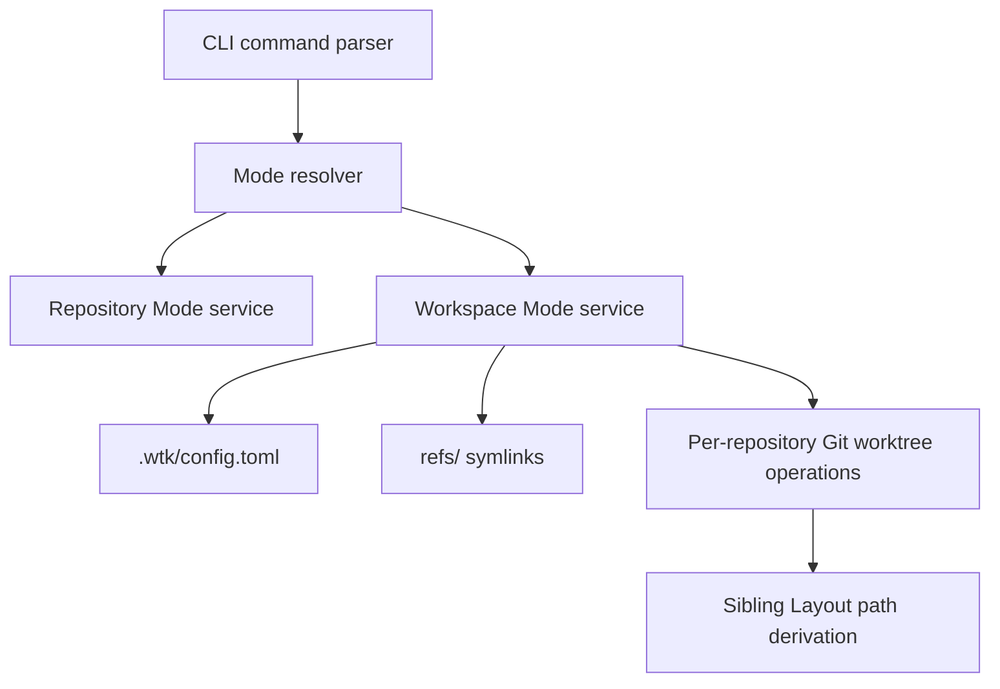

## Overview

### Problem Statement

- Issue 45 asks `wtk` to support a parent-directory worktree mode.
- The selected worktree mode should be reflected in `wtk status`.
- `wtk` should also support linked worktrees across multiple repositories.

### Scope

- Define the product semantics for workspace mode and multi-repository linked worktrees.
- Update the relevant `wtk` commands and status output once the mode semantics are decided.
- Preserve current fail-fast behavior: missing config, ambiguous discovery, or invalid repository state should produce clear failures rather than hidden fallbacks.

### User Intent

- Keep existing repositories and Git worktrees managed with the current sibling layout.
- Add a Workspace Mode where a lightweight Git repository aggregates several repositories through symlinks.
- Store refs in the workspace; each ref points to the currently surfaced worktree path for a related repository such as A, B, or C.
- Worktree paths are derived from the workspace worktree/branch name using the existing sibling layout rule.
- Switching the workspace changes which coordinated repository worktrees are surfaced through the workspace.
- The goal is to avoid mixed-source edits caused by creating or switching a worktree in one repository while related repositories still point at unrelated branches or worktrees.
- Workspace metadata should live in `.wtk/config.toml` and include the current mode plus workspace refs.
- `wtk` should not restrict arbitrary repository contents in the Workspace beyond the configuration and ref invariants it needs to operate.
- Workspace Mode configuration should record the stable repository path for each ref.
- For a workspace ref, the ref name, fixed ref path, and configured repository directory name must remain consistent. For example, ref name `A`, ref path `refs/A`, and repository directory `/path/to/A` match; mismatches are errors.
- Ref targets are worktree paths, not stable repository paths.
- Repository paths in `.wtk/config.toml` and Workspace Ref targets must be absolute paths.
- The workspace worktree/branch name must be creatable in every linked repository before a Workspace Mode worktree operation can continue.
- If any repository cannot create the required branch/worktree because of a collision or another required-step failure, `wtk` must fail and roll back every repository already changed by that operation.
- Workspace names, branch names, and derived worktree paths must all follow the existing sibling layout rules used by Repository Mode.
- Workspace create/switch operations must run a full preflight before making changes to avoid dirty partial state.
- Workspace setup uses `wtk workspace init` to initialize Workspace Mode config and `wtk workspace add <repository-path>` to add refs from repository paths, converting input paths to absolute paths.
- `wtk workspace add <repository-path>` initializes the new `refs/<name>` target to that repository's main worktree path.
- Adding a new Workspace Ref is allowed only when every existing Workspace Ref points to its repository's main worktree.
- Existing worktree operations keep their command names. In Workspace Mode, `new`, `remove`, `send-out`, and `bring-in` dispatch the corresponding operation into each configured ref repository instead of only the current repository.
- `wtk status` in Workspace Mode should output an initial aggregate workspace status, but any inconsistency in config, refs, repository identity, or expected worktree state must fail fast.
- Workspace rollback should only undo resources created or modified by the current `wtk` operation; it must not delete branches or worktrees that existed before the operation began.
- Name the current default single-repository behavior Repository Mode.
- Name the new coordinated multi-repository behavior Workspace Mode.

## Research

### Existing System

- The public command surface describes `wtk new`, `checkout`, `status`, `remove`, `send-out`, `bring-in`, and the `create` compatibility alias. Source: `README.md:3-12`
- Current documentation defines default linked worktree paths as sibling directories named `<repo>-wt-<branch-slug>`. Source: `README.md:14`
- `paths::default_path` implements the current sibling layout by taking `main_root.parent()` and joining `<repo>-wt-<branch-slug>`. Source: `src/paths.rs:35-44`
- `worktree::create` and `worktree::checkout` both call `create_target_path`, which uses `default_path` when `--path` is empty. Source: `src/worktree.rs:95-101,137-143,471-484`
- `RepoContext` represents one resolved Git repository/worktree set: `cwd`, `current_root`, `main_root`, `git_common_dir`, `current_is_main`, and `worktrees`. Source: `src/gitexec.rs:14-22`
- Repository context resolution uses Git as the source of truth: `rev-parse --show-toplevel`, `rev-parse --git-common-dir`, and `git worktree list --porcelain`. Source: `src/gitexec.rs:154-190`
- `wtk status` currently serializes a single-repository YAML payload with `cwd`, `current_root`, `main_root`, `git_common_dir`, `current_is_main`, and `worktrees`; it has no worktree mode field. Source: `src/worktree.rs:58-76,172-197`
- Existing E2E coverage asserts the current `status` YAML schema for a linked worktree in one repository. Source: `tests/e2e.rs:108-144`
- Test helpers also encode the current sibling default path rule. Source: `tests/e2e.rs:1223-1229`
- The async initialization spec added and implemented `init-worktree`; it is an internal/advanced worktree initialization command, not a parent-directory or multi-repo mode. Source: `specs/change/20260525-async-worktree-initialization/spec.md:70-116`

### Design Inputs

- Issue 45 explicitly requires parent-directory worktree mode, mode visibility in `wtk status`, and linked worktrees across multiple repositories, but does not define the mode shape, configuration source, discovery range, or YAML schema. Source: `https://github.com/nettee/worktree-kit/issues/45`
- Historical rewrite design intentionally kept Git worktree orchestration semantics and path rules compatible with the existing implementation, so changing the default layout is a compatibility decision rather than an implementation detail. Source: `specs/change/20260522-rust-rewrite-wtk/spec.md:76-77`
- The README states commands print underlying Git commands, successful commands copy useful payloads to the clipboard, and required-step failures are reported directly. Source: `README.md:75-81,108-110`

### Constraints & Dependencies

- Parent-directory mode needs an explicit model for path derivation before `create`/`checkout` can change safely, because current implicit paths are computed centrally in `paths::default_path`. Source: `src/paths.rs:35-44`, `src/worktree.rs:471-484`
- Multi-repository linked worktrees require either an aggregate discovery model or a scoped single-repository model, because `RepoContext` currently resolves only the Git repository containing the current working directory. Source: `src/gitexec.rs:14-22,154-190`
- `status` schema changes require E2E updates because the YAML fields are directly asserted. Source: `tests/e2e.rs:108-144`

### Key References

- `https://github.com/nettee/worktree-kit/issues/45` - requested feature.
- `README.md:3-14,75-81,108-110` - current public command, path, and failure behavior.
- `src/paths.rs:35-44` - current default path layout.
- `src/gitexec.rs:14-22,154-190` - current single-repository context resolution.
- `src/worktree.rs:58-76,172-197,471-484` - status payload and target path selection.
- `tests/e2e.rs:108-144,1223-1229` - current status and path behavior tests.

## Design

### Design Summary

- Add a Workspace layer above existing repository worktrees.
- Keep each repository's real Git worktrees in the current sibling layout.
- Represent a multi-repository feature workspace as a lightweight Git repository whose refs point to current worktree paths.
- Treat `.wtk/config.toml` as the source of truth for linked repository identity and the Workspace repository's current ref state as the source of truth for currently surfaced worktrees.
- Store mode and stable repository paths in `.wtk/config.toml`.
- Keep Repository Mode as the default mode; use Workspace Mode only when `.wtk/config.toml` explicitly selects it.
- In Workspace Mode, configuration records stable repository paths per ref; refs point at currently surfaced worktree paths.

Configuration shape:

```toml
mode = "workspace"

[workspace.refs.A]
repository = "/absolute/path/to/A"

[workspace.refs.B]
repository = "/absolute/path/to/B"
```

### Design Decisions

- Decision: Do not replace sibling layout for real Git worktrees; Workspace Mode composes existing per-repository worktrees through refs and derived worktree paths. Source: `README.md:14`, `src/paths.rs:35-44`
- Decision: Workspace refs point to current worktree paths because duplicating the same visible name as both a repo ref and worktree entry would be confusing; stable repository paths live in `.wtk/config.toml`. Source: user design decision, 2026-06-07.
- Decision: Workspace create/switch operations must preflight every linked repository and roll back all changed repositories if any branch/worktree cannot be created. This preserves all-or-nothing coordination instead of leaving repositories mixed across workspace states. Source: `README.md:108-110`, user design decision, 2026-06-07.
- Decision: Use `.wtk/config.toml` for mode and workspace ref metadata instead of constraining the rest of the Workspace repository contents. Source: user design decision, 2026-06-07.
- Decision: Use `Repository Mode` for the existing default single-repository behavior and `Workspace Mode` for the new coordinated multi-repository behavior; do not name the old mode after sibling layout because sibling layout is a path strategy, not the behavioral boundary. Source: `README.md:3-14`, user design decision, 2026-06-07.
- Decision: Workspace config should record stable repository paths, not per-worktree paths; for ref `A`, the Workspace Ref path is fixed as `refs/A`, the configured repository path must point to repository `A`, and the repository directory name must also be `A`. Mismatches fail fast. Source: user design decision, 2026-06-07.
- Decision: Require absolute paths for both configured repository paths and Workspace Ref targets to avoid ambiguous relative symlink interpretation and make validation deterministic. Source: user design decision, 2026-06-07.
- Decision: Workspace Mode must derive every repository branch and worktree path from the workspace name using the same sibling layout rules as Repository Mode. Source: `README.md:14`, `src/paths.rs:35-44`, user design decision, 2026-06-07.
- Decision: Run full preflight before any Workspace create/switch mutation, covering config mode, ref/repository naming consistency, absolute paths, Git repository validity, target branch/worktree availability, and clean-state requirements. Source: `README.md:108-110`, user design decision, 2026-06-07.
- Decision: Add `wtk workspace init` for creating Workspace Mode config and `wtk workspace add <repository-path>` for adding configured refs from repository paths normalized to absolute paths. Source: user design decision, 2026-06-07.
- Decision: Do not introduce a separate `workspace switch` verb for core worktree movement; existing worktree commands should inspect the current mode and run Repository Mode or Workspace Mode behavior. Source: `README.md:3-12`, user design decision, 2026-06-07.
- Decision: `workspace add` initializes the new ref to the repository's main worktree, and it is blocked unless all existing refs also point to their main worktrees. Source: user design decision, 2026-06-07.
- Decision: `wtk status` in Workspace Mode should provide a first-pass aggregate status view, but inconsistent workspace state exits non-zero instead of reporting a successful status payload with embedded invalid entries. Source: user design decision, 2026-06-07.
- Decision: Rollback scope is limited to resources created or changed by the current operation. Pre-existing branches/worktrees must be preserved, and rollback failures must be reported as failures. Source: user design decision, 2026-06-07.

### System Procedure

Workspace create/switch preflight:

1. Read `.wtk/config.toml` and require `mode = "workspace"`.
2. For every configured ref, require ref name, `refs/<name>`, and repository basename to match.
3. Require configured repository paths and existing Workspace Ref targets to be absolute paths.
4. Resolve every configured repository as a Git repository.
5. Derive the target branch and sibling-layout worktree path from the workspace name for every repository.
6. Verify every repository can create or switch to the target branch/worktree without collisions or dirty-state violations.
7. Mutate only after all repositories pass preflight.
8. If execution fails after mutation begins, roll back only worktrees, branches, and Workspace Refs created or modified by this operation.

Workspace command routing:

1. Resolve the current mode from `.wtk/config.toml` when present.
2. In Repository Mode, keep existing single-repository command behavior.
3. In Workspace Mode, load configured refs and run the requested worktree operation against every ref repository.
4. Update `refs/<name>` only after the corresponding repository operation succeeds, and roll back all changed refs if any repository operation fails.

Workspace add procedure:

1. Require Workspace Mode.
2. Require every existing Workspace Ref to point to its configured repository's main worktree.
3. Convert the input repository path to an absolute path and resolve it as a Git repository.
4. Derive the ref name from the repository directory basename.
5. Add `[workspace.refs.<name>]` with the stable repository path.
6. Create `refs/<name>` pointing to the repository's main worktree path.

Workspace status procedure:

1. Require Workspace Mode config to parse successfully.
2. Validate every configured ref path and target before emitting success output.
3. For each ref, include the ref name, configured repository path, ref path, current target, inferred branch/worktree state, and expected sibling-layout path when applicable.
4. Exit non-zero with a clear diagnostic on any mismatch or missing required state.

### System Structure



### Interfaces / APIs

- `wtk workspace init`
  - Initializes `.wtk/config.toml` with `mode = "workspace"`.
  - Fails if existing config would be overwritten without an explicit future force mechanism.
- `wtk workspace add <repository-path>`
  - Converts `<repository-path>` to an absolute path.
  - Adds `[workspace.refs.<basename>] repository = "<absolute path>"`.
  - Creates `refs/<basename>` pointing to the repository's main worktree.
  - Fails unless all existing refs point to their repositories' main worktrees.
- Existing commands in Workspace Mode:
  - `wtk new <branch>` creates the same branch/worktree across all configured refs.
  - `wtk remove <branch-or-worktree>` removes the coordinated workspace worktrees across all configured refs after preflight.
  - `wtk send-out` sends the coordinated current branch out across all configured refs.
  - `wtk bring-in <branch>` brings the coordinated branch back across all configured refs.
  - `wtk status` emits aggregate Workspace Mode status after validation succeeds.

### Change Scope

- Impact Areas:
  - Mode resolution: detect Repository Mode vs Workspace Mode from `.wtk/config.toml`.
  - Configuration: parse and write TOML workspace config.
  - Workspace refs: create, validate, and update absolute symlink targets under `refs/<name>`.
  - Command routing: dispatch existing worktree commands to single-repo or multi-repo behavior based on mode.
  - Transaction safety: add preflight and rollback tracking for Workspace Mode operations.
  - Status output: add mode visibility and first-pass aggregate Workspace Mode status.
  - Documentation and tests: document the new mode and add E2E coverage for setup, fan-out, validation failure, and rollback.

- Planned File Changes:
  - `src/cli.rs` - parse `workspace init` / `workspace add` and route existing commands through mode resolution.
  - `src/worktree.rs` - preserve Repository Mode behavior and expose reusable per-repository operation helpers for Workspace Mode.
  - `src/gitexec.rs` - reuse repo/worktree resolution for configured repositories and Workspace Ref target validation.
  - `src/paths.rs` - reuse sibling layout derivation for Workspace Mode expected paths.
  - `src/workspace.rs` or equivalent - implement config parsing/writing, ref validation, preflight, transaction tracking, rollback, and aggregate status.
  - `tests/e2e.rs` - add Workspace Mode setup, status, all-repo new/remove/send-out/bring-in, preflight failure, and rollback tests.
  - `README.md` - document Repository Mode, Workspace Mode, `.wtk/config.toml`, `workspace init`, and `workspace add`.
  - `CONTEXT.md` - keep terminology aligned as implementation decisions settle.

### Edge Cases

- Missing `.wtk/config.toml` keeps the CLI in Repository Mode.
- Malformed `.wtk/config.toml`, unknown mode, relative repository path, or relative ref target fails fast.
- Configured ref `A` whose repository basename is not `A` fails fast.
- Configured ref without `refs/A`, or `refs/A` pointing outside repository `A`'s Git worktree set, fails fast.
- `workspace add` is blocked when any existing ref points away from its repository main worktree.
- Workspace `new` is blocked when any linked repository already has the target branch or derived sibling worktree path in an incompatible state.
- Workspace operations preserve pre-existing branches/worktrees during rollback and only undo resources changed by the current operation.
- Rollback failure is itself a command failure and must describe both the original failure and rollback failure state.

### Verification Strategy

- Unit tests for config parsing/writing, absolute path validation, ref-name validation, and sibling-layout expected path derivation. Source: `src/paths.rs:3-44`
- Unit tests or focused integration tests for transaction logs to ensure rollback only touches resources created or modified by the current operation. Source: `README.md:108-110`
- E2E tests for `workspace init`, `workspace add`, and initial `refs/<name>` targets pointing at main worktrees.
- E2E tests for Workspace Mode `new` creating same-named branches/worktrees across A/B/C and updating refs after all preflight passes.
- E2E tests for preflight failures with branch collisions, worktree path collisions, invalid refs, relative targets, and dirty worktrees.
- E2E tests for rollback when a later repository operation fails after an earlier repository was changed.
- E2E tests for Workspace Mode `status` success output and fail-fast behavior on inconsistent refs. Source: `tests/e2e.rs:108-144`

## Plan

### Step 1: Mode And Workspace Config Foundation

Type: AFK
Goal: Add the smallest durable Workspace Mode foundation without changing existing Repository Mode behavior.
Scope: Implement `.wtk/config.toml` parsing/writing, mode resolution, `wtk workspace init`, and `wtk workspace add <repository-path>` with absolute path normalization, ref-name validation, and initial `refs/<name>` creation pointing at the repository main worktree.
Depends on: None
Acceptance Criteria: Existing Repository Mode tests still pass; `workspace add` fails unless existing refs all point at their repositories' main worktrees.

### Step 2: Workspace Status

Type: AFK
Goal: Make `wtk status` mode-aware and expose a first-pass aggregate Workspace Mode status.
Scope: Route `status` through mode resolution, validate configured refs before success output, include mode/config/ref/repository/worktree fields, and fail fast on malformed config, missing refs, relative targets, wrong repository identity, or inconsistent worktree targets.
Depends on: Step 1

### Step 3: Workspace New

Type: AFK
Goal: Fan out `wtk new <branch>` across every configured Workspace Ref with all-or-nothing behavior.
Scope: Preflight every linked repository, derive sibling-layout target worktree paths from the branch name, create branches/worktrees only after preflight passes, update refs after successful per-repo creation, and roll back resources created by this operation on failure.
Depends on: Step 1
Acceptance Criteria: Branch/worktree collisions in any repository prevent mutation; execution failure after partial mutation restores changed refs and removes only operation-created resources.

### Step 4: Workspace Remove

Type: AFK
Goal: Fan out coordinated removal across Workspace Mode refs while preserving pre-existing resources.
Scope: Define and implement Workspace Mode `remove` behavior against the configured repositories, with full preflight, ref restoration, and rollback boundaries matching the Design.
Depends on: Step 3

### Step 5: Workspace Send-Out And Bring-In

Type: AFK
Goal: Extend coordinated branch movement workflows to Workspace Mode.
Scope: Implement Workspace Mode `send-out` and `bring-in` by applying the Repository Mode semantics to every configured ref repository with full preflight and rollback tracking.
Depends on: Step 3

### Step 6: Documentation And Regression Coverage

Type: AFK
Goal: Make the new mode understandable and protect the compatibility boundary.
Scope: Update README and focused tests for Repository Mode compatibility, Workspace Mode setup, status, all-repo operations, preflight failures, and rollback failures.
Depends on: Steps 1-5

## Notes

### Progress

- [x] Step 1: Mode And Workspace Config Foundation
- [x] Step 2: Workspace Status
- [x] Step 3: Workspace New
- [x] Step 4: Workspace Remove
- [x] Step 5: Workspace Send-Out And Bring-In
- [x] Step 6: Documentation And Regression Coverage

### Implementation

- Added `src/workspace.rs` for Workspace Mode config, ref symlinks, aggregate status, fan-out operations, preflight checks, and rollback actions.
- Routed `new`, `create`, `status`, `remove`, `send-out`, and `bring-in` through mode resolution while preserving Repository Mode behavior.
- Added `wtk workspace init` and `wtk workspace add <repository-path>`.
- Documented Repository Mode, Workspace Mode, config shape, and Workspace command behavior in `README.md`.
- Added a focused E2E tracer covering workspace init/add/status/new/remove/send-out/bring-in.

### Verification

- `cargo fmt && cargo test` passed.
