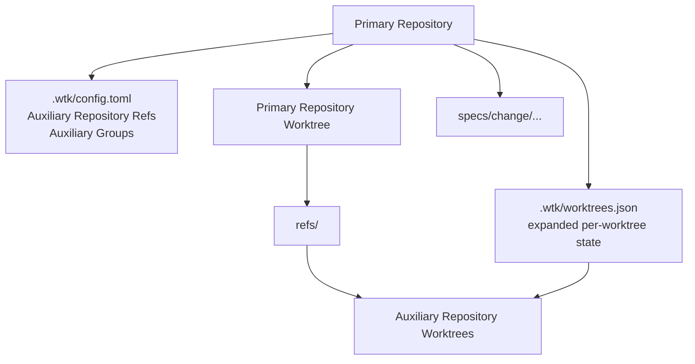

# Design

## Research

### Existing System

- Workspace Mode coordinates multiple Linked Repositories from a Workspace repository, with stable membership in tracked `.wtk-workspace.toml` and generated `refs/<name>` entries in each Workspace Worktree. Source: `README.md:16-18`, `CONTEXT.md:18-40`.
- `wtk workspace bootstrap` initializes a Workspace from an empty directory, writes `.wtk-workspace.toml`, creates generated refs, writes `.gitignore` containing `refs/`, initializes `AGENTS.md`, and commits the tracked bootstrap files. Source: `README.md:87-98`, `src/workspace.rs:235-271`.
- The generated Workspace `AGENTS.md` tells agents that the Workspace is a shared entrypoint, feature code lives through Workspace Refs, `.wtk-workspace.toml` is tracked manifest state, and `refs/` is generated local state that must not be committed. Source: `src/templates/workspace/AGENTS.md:1-15`.
- Workspace membership today is encoded as `[workspace.refs.<name>] repository = "/absolute/path"` in `.wtk-workspace.toml`; ref names must match linked repository basenames. Source: `README.md:107-114`, `src/workspace.rs:761-767`.
- Workspace commands currently validate generated refs against expected Repository Worktree targets and fail on missing, relative, wrong-target, or branch-mismatched refs in status/remove paths. Source: `src/workspace.rs:747-810`.
- Workspace `new` creates a Workspace Worktree plus matching Repository Worktrees, then writes `refs/<name>` inside the new Workspace Worktree to point at the matching Repository Worktree target. Source: `src/workspace.rs:483-609`.
- Workspace `remove` removes the coordinated Workspace Worktree and matching linked Repository Worktrees after validating refs and clean state. Source: `src/workspace.rs:611-710`.
- Workspace list treats broken Workspace Ref details as row diagnostics, while status remains stricter and validates refs before success. Source: `e2e/test_workspace_mode.py:71-188`, `src/workspace.rs:285-320`, `src/workspace.rs:332-456`.
- Repository Mode `send-out` has a targeted special case for an ignored active Zest spec path, `specs/change/active`, and copies that ignored file into the linked worktree during send-out initialization. Source: `src/worktree.rs:23-25`, `src/worktree.rs:845-879`.
- Zest specs are stored under persistent `specs/change/<date>-<slug>/...` directories, while `specs/change/active` is an ignored active-spec pointer. Source: `.gitignore:6`, `specs/change/20260612-workspace-spec-helper-repo-refs/spec.md:1-8`.
- The generated Workspace `AGENTS.md` currently says the Workspace is a shared entrypoint that does not contain feature code; code changes happen through generated refs into Linked Repositories. Source: `src/templates/workspace/AGENTS.md:3-9`.

### Design Inputs

- Issue 70 proposes improving Workspace spec persistence with a new mode that remains under the main repository but uses refs to a helper repository, and documents that convention in `AGENTS.md`. Source: https://github.com/nettee/worktree-kit/issues/70.
- The intended direction is to remove the current Workspace Mode / Repository Mode / Workspace Repository / Linked Repository mental model and replace it with a Primary Repository centered model. Source: user clarification, 2026-06-12.
- Agents open the Primary Repository directly; the Primary Repository is the task entrypoint, context center, and natural home for specs. Source: user clarification, 2026-06-12.
- Specs remain in the Primary Repository under `specs/change/...`; they must not move into any dedicated auxiliary repository. Source: user clarification, 2026-06-12.
- Confirmed terminology: the main task entry repository is the Primary Repository, collaborating code repositories are Auxiliary Repositories, the no-auxiliary mode is Standalone Mode, and the auxiliary-linked mode is Coordinated Mode. Source: user clarification, 2026-06-12; `CONTEXT.md`.
- Current project language already defines Workspace, Workspace Worktree, Workspace Ref, Linked Repository, and Workspace Manifest; "helper repository" is not yet defined as a canonical term. Source: `CONTEXT.md:18-40`.
- Current README presents Workspace Refs as links to Linked Repository worktrees, not as links to auxiliary metadata/spec storage. Source: `README.md:16-18`, `README.md:116-118`.
- Current Workspace bootstrap template frames all generated refs as Linked Repository surfaces for feature code and PR creation. Source: `src/templates/workspace/AGENTS.md:3-9`.
- The existing active-spec copy path is limited to Repository Mode `send-out`; it does not define a Workspace-level persistence model for all specs. Source: `src/worktree.rs:845-879`.

### Constraints & Dependencies

- Zest Dev requires code-, documentation-, or web-confirmed facts to cite their sources in research and design. Source: `/Users/william/.agents/skills/zest-dev/research.md`.
- This project prefers fail-fast behavior for missing config, bad inputs, failed subprocesses, violated invariants, and hidden fallback data. Source: AGENTS.md instructions supplied in conversation, 2026-06-12.
- Existing Workspace Mode already distinguishes tracked Workspace Manifest state from generated local Workspace Ref state; spec persistence must decide whether helper-repo refs are manifest-managed, generated, tracked, or a separate category. Source: `README.md:97-118`, `src/templates/workspace/AGENTS.md:11-15`.
- Existing Workspace Mode requires membership changes from the Workspace main worktree. Source: `README.md:118`, `src/workspace.rs:140-160`.
- The current CLI dispatch has only `Mode::Repository` and `Mode::Workspace`; `checkout`, `send-out`, and `bring-in` are rejected in Workspace Mode. Source: `src/cli.rs:125-200`, `src/workspace.rs:23-28`.
- Current mode resolution is implicit: finding `.wtk-workspace.toml` selects Workspace Mode, and absence of that manifest selects Repository Mode. Source: `src/workspace.rs:23-28,118-136`.
- The current CLI command parsers do not expose a runtime mode selection flag for `new`, `status`, `list`, `remove`, `checkout`, `send-out`, or `bring-in`; dispatch calls `resolve_mode` directly. Source: `src/cli.rs:125-200,718-771`.
- Git worktree discovery returns Git facts (`path`, `branch`, `head`, lock/prune state) and does not contain WTK-owned per-worktree metadata. Source: `src/gitexec.rs:7-20`.
- The user wants WTK commands to support selecting a mode at runtime, a configurable default mode, and Coordinated Mode defaults that can include a predefined set of Auxiliary Repositories. Source: user clarification, 2026-06-12.
- Worktree mode selection should be fixed at creation time and immutable afterward. Source: user clarification, 2026-06-12.
- The effective WTK selection is not just `standalone | coordinated`; it must distinguish `standalone`, `coordinated` with auxiliary set A, `coordinated` with auxiliary set B, and so on. Source: user clarification, 2026-06-12.
- The primary user-facing concept should be Auxiliary Group, not Worktree Profile. A worktree selects zero or more Auxiliary Groups at creation time, and the selection is immutable afterward. Source: user clarification, 2026-06-12; `CONTEXT.md`.
- Selecting no Auxiliary Groups is the standalone case; selecting one or more Auxiliary Groups is the coordinated case. Source: user clarification, 2026-06-12; `CONTEXT.md`.
- Auxiliary Groups should initially define only Auxiliary Repository membership; branch naming, base branch, path rules, and PR policy should remain outside Auxiliary Group configuration. Source: user confirmation, 2026-06-12.
- The default should be no Auxiliary Groups because it is least surprising and least risky. Source: user clarification, 2026-06-12.
- Auxiliary Group configuration should be stored under `.wtk/config.toml`, and WTK should not enforce whether users track or ignore that configuration in Git. Source: user clarification, 2026-06-12.
- Fixed per-worktree expanded Auxiliary Repository state should be stored under `.wtk/worktrees.json`; WTK does not need to preserve the selected Auxiliary Group names after creation. Source: user clarification, 2026-06-12.
- Repository-level default group configuration is out of scope for this change; commands that do not explicitly select Auxiliary Groups should create a worktree with no Auxiliary Groups. Source: user clarification, 2026-06-12.
- If multiple selected Auxiliary Groups include the same Auxiliary Repository, WTK should automatically deduplicate that repository. Source: user clarification, 2026-06-12.
- `.wtk/worktrees.json` should key per-worktree state by absolute Primary Repository worktree path. Source: user confirmation, 2026-06-12.
- Auxiliary Repository names should be derived from the repository path's final segment, not configured as independent arbitrary IDs. Source: user confirmation, 2026-06-12.
- Existing Workspace Ref config uses `[workspace.refs.<name>] repository = "/absolute/path"` and validates that `<name>` matches the repository basename. Source: `README.md:107-114`, `src/workspace.rs:761-767`.
- Auxiliary Repository Refs should remain an explicit configuration layer. Auxiliary Groups should reference Auxiliary Repository Refs instead of directly storing repository paths, keeping repository-level configuration orthogonal to group membership. Source: user clarification, 2026-06-12.
- When users create a group, they should only need to provide a group name and Auxiliary Repository paths; WTK should derive ref names from repository path final segments, create or reuse the Auxiliary Repository Ref configuration, and add those refs to the group. Source: user clarification, 2026-06-12.
- Standalone Auxiliary Repository Ref management commands are out of scope for this change; refs are created or reused only through Auxiliary Group creation. Source: user confirmation, 2026-06-12.
- Auxiliary Groups should be created with `wtk auxiliary-group add <group-name> <repository-path>...`, and `wtk ag ...` should be a supported shorthand. Source: user confirmation, 2026-06-12.
- `wtk new` should select Auxiliary Groups with repeatable `--ag <group-name>` / `--auxiliary-group <group-name>` flags. Source: user confirmation, 2026-06-12.
- `ag` should consistently mean `auxiliary group` in both the `wtk ag` command shorthand and the `wtk new --ag` flag. Source: user confirmation, 2026-06-12.
- Primary Repository worktrees with Auxiliary Repositories should generate `refs/<auxiliary-name>` entries pointing to the corresponding Auxiliary Repository worktrees, reusing the existing Workspace Ref structure and validation style. Source: user confirmation, 2026-06-12; `src/workspace.rs:747-810`.

### Key References

- `CONTEXT.md:18-40` - canonical Workspace terminology.
- `README.md:87-118` - documented Workspace bootstrap, manifest, generated refs, and command behavior.
- `src/workspace.rs:17-21,235-271,747-810` - manifest/ref constants, bootstrap behavior, and ref validation.
- `src/templates/workspace/AGENTS.md:1-15` - generated Workspace agent guidance.
- `src/worktree.rs:23-25,845-879` - existing ignored active-spec copy path.
- `e2e/test_workspace_mode.py:221-270` - bootstrap test coverage for tracked files, refs, and `AGENTS.md`.
- `.gitignore:6` - ignored active-spec pointer.

## Design Detail

### Design Decisions

- Replace user-facing mode selection with Auxiliary Groups. `Standalone Mode` and `Coordinated Mode` remain derived descriptions only: no selected groups is standalone, one or more selected groups is coordinated. Source: user clarification, 2026-06-12; `CONTEXT.md`.
- Keep specs in the Primary Repository and never move them to an auxiliary or workspace repository. Source: user clarification, 2026-06-12; `.gitignore:6`; `specs/change/20260612-workspace-spec-helper-repo-refs/spec.md:1-8`.
- Store Auxiliary Group configuration in `.wtk/config.toml` and per-worktree expanded Auxiliary Repository state in `.wtk/worktrees.json`. Source: user clarification, 2026-06-12.
- Do not implement repository-level default groups in this change. `wtk new` without `--ag` / `--auxiliary-group` creates only the Primary Repository worktree. Source: user clarification, 2026-06-12.
- Keep Auxiliary Repository Refs as an explicit configuration layer, and make Auxiliary Groups reference refs instead of repository paths. This follows the existing Workspace Ref shape while keeping repository-level config orthogonal to group membership. Source: user clarification, 2026-06-12; `README.md:107-114`; `src/workspace.rs:761-767`.
- Create or reuse Auxiliary Repository Refs only through `wtk auxiliary-group add` / `wtk ag add`; standalone ref management commands are out of scope. Source: user confirmation, 2026-06-12.
- Generate `refs/<auxiliary-name>` in Primary worktrees and validate them against `.wtk/worktrees.json`, following the existing Workspace Ref fail-fast behavior. Source: user confirmation, 2026-06-12; `src/workspace.rs:747-810`.
- Treat `.wtk/config.toml` as local WTK configuration without enforcing whether users track or ignore it in Git. Source: user clarification, 2026-06-12.

### System Structure



### Configuration Shape

`.wtk/config.toml` stores local reusable inputs for future worktree creation:

```toml
[auxiliaries.api]
repository = "/path/to/api"

[auxiliaries.web]
repository = "/path/to/web"

[groups.full-stack]
auxiliaries = ["api", "web"]
```

Rules:

- Auxiliary Repository Ref names are derived from repository path basenames and must match the configured repository basename.
- Group creation accepts repository paths, derives names, creates or reuses `[auxiliaries.<name>]`, and writes `[groups.<group-name>]`.
- Existing `[auxiliaries.<name>]` may be reused only when it resolves to the same repository.
- Group config that references a missing auxiliary ref fails.
- Custom Auxiliary Groups must contain at least one Auxiliary Repository Ref; an empty group is invalid because the no-group case already represents ordinary Primary worktree creation.
- `wtk auxiliary-group add` fails when the same resolved repository appears more than once in the input paths.
- Duplicate selected groups are deduplicated.
- Multiple selected groups that include the same resolved Auxiliary Repository are deduplicated.
- Different repositories that derive the same auxiliary name fail.

`.wtk/worktrees.json` stores immutable expanded state keyed by absolute Primary Repository worktree path:

```json
{
  "version": 1,
  "worktrees": {
    "/path/to/primary-wt-feature-x": {
      "branch": "feature/x",
      "auxiliaries": {
        "api": {
          "repository": "/path/to/api",
          "worktree": "/path/to/api-wt-feature-x"
        },
        "web": {
          "repository": "/path/to/web",
          "worktree": "/path/to/web-wt-feature-x"
        }
      }
    }
  }
}
```

Rules:

- Worktree state stores expanded Auxiliary Repository state, not selected group names.
- Existing worktree behavior does not change when `.wtk/config.toml` changes later.
- Missing, malformed, or inconsistent state fails fast.
- Moving a Primary worktree outside WTK leaves the absolute path key stale; WTK should report the mismatch instead of guessing.

### Command Behavior

`wtk auxiliary-group add <group-name> <repository-path>...`

- Alias: `wtk ag add <group-name> <repository-path>...`.
- Requires at least one repository path.
- Resolves each path to a Git main worktree.
- Derives each Auxiliary Repository Ref name from the repository basename.
- Creates or reuses matching `[auxiliaries.<name>]` entries.
- Writes `[groups.<group-name>] auxiliaries = [...]`.
- Updates only `.wtk/config.toml`; it does not create generated refs or auxiliary state for the Primary Repository main worktree.
- Fails if the group already exists; this change does not include group update/delete commands.

`wtk new <branch> [--ag <group>]... [--auxiliary-group <group>]...`

- Without group flags, creates only the Primary Repository worktree.
- With group flags, loads `.wtk/config.toml`, expands groups to Auxiliary Repository Refs, deduplicates resolved repositories, then creates matching Auxiliary Repository worktrees using the existing sibling layout convention.
- `--path` is not supported when Auxiliary Groups are selected; Primary and Auxiliary worktree paths are derived from the branch using the sibling layout convention.
- Before creating any worktree, preflight the Primary Repository and all selected Auxiliary Repositories: base ref must exist, target branch must not exist, and target worktree path must be creatable.
- Writes `.wtk/worktrees.json` entry keyed by the absolute Primary worktree path.
- Writes generated `refs/<auxiliary-name>` entries in the Primary worktree pointing to Auxiliary Repository worktrees.
- Rolls back synchronous failures, including worktree creation, branch creation, generated ref writes, `.wtk/worktrees.json` writes, and ignored `.env` copy failures.
- Once asynchronous pnpm install has started, later pnpm failures should remain observable and should not roll back the created worktrees or recorded state.

`wtk status`, `wtk list`, and `wtk remove`

- Read `.wtk/worktrees.json` for Primary worktrees that have recorded auxiliary state.
- `wtk status` reports current worktree state, not available Auxiliary Group configuration. If the current Primary worktree has no recorded auxiliary state, report ordinary Primary worktree status even when `.wtk/config.toml` defines groups.
- Validate generated refs against recorded state before reporting success or removal.
- Treat broken refs as diagnostics in list output, matching the existing Workspace list/status strictness split where practical.
- List both ordinary Primary Repository worktrees with no auxiliary state and Primary Repository worktrees with recorded auxiliary state. This follows the old Workspace list pattern where list rows can carry extra ref-health details without making every row a different top-level command mode.
- Before removing a Primary worktree with auxiliary state, require the Primary worktree and all recorded Auxiliary Repository worktrees to be clean. Ignore generated `refs/` dirtiness only in the Primary worktree.
- Remove recorded Auxiliary Repository worktrees when removing a Primary worktree with auxiliary state.

`wtk send-out` and `wtk bring-in`

- Remain Primary Repository commands for ordinary worktrees.
- Must reject worktrees with auxiliary state recorded in `.wtk/worktrees.json`.
- Rationale: these commands move a branch between the Primary main worktree and one linked worktree; they do not have a defined atomic operation for moving a coordinated set of Auxiliary Repository worktrees. Continuing anyway would hide partial multi-repository state.

### Legacy Removal Scope

Remove these legacy concepts from the user-facing model:

- `Workspace Mode` as an active mode users choose or enter.
- `Repository Mode` as the named opposite of Workspace Mode.
- `Workspace Repository` as a separate repository that coordinates peer repositories.
- `Workspace Worktree` as the coordinated state holder.
- `Linked Repository` as the user-facing name for participating repositories.
- `Workspace Manifest` as tracked `.wtk-workspace.toml` membership state.

Remove these command entrypoints:

- `wtk workspace init`
- `wtk workspace add <repository-path>`
- `wtk workspace bootstrap <repository-path>...`
- The top-level `workspace` command help, parser branch, completions, and CLI error expectations.

Remove or replace these implementation artifacts:

- `.wtk-workspace.toml` creation and mode detection.
- `Mode::Repository` / `Mode::Workspace` dispatch as the core command router.
- Workspace bootstrap behavior that initializes a new Git repository, writes `.gitignore`, writes Workspace `AGENTS.md`, and creates an initial Workspace commit.
- Generated Workspace `AGENTS.md` template under `src/templates/workspace/`.
- Workspace-specific status/list output fields that describe `workspace_worktree`, `workspace_main_worktree`, and `workspace_branch`.
- Workspace Mode e2e coverage such as `e2e/test_workspace_mode.py`, replacing it with Auxiliary Group e2e coverage.
- README sections that teach Workspace Mode setup, manifest shape, or Workspace command restrictions.

Keep these existing commands, but remove their Repository Mode vs Workspace Mode split:

- `wtk new` remains the worktree creation command and gains `--ag` / `--auxiliary-group`.
- `wtk status`, `wtk list`, and `wtk remove` remain lifecycle/status commands and become auxiliary-aware through `.wtk/worktrees.json`.
- `wtk checkout`, `wtk send-out`, and `wtk bring-in` remain Primary Repository commands; this change should remove Workspace Mode rejection branches rather than deleting the commands.
- The existing ignored active-spec copy behavior in `send-out` is not a Workspace Repository feature; keep it unless the implementation proves it conflicts with Primary Repository spec ownership.

Reuse these mechanics without preserving the old model:

- Repository basename validation for ref names.
- Generated `refs/<name>` entries.
- Strict status/remove ref validation and list diagnostics for broken refs.
- Multi-repository preflight and rollback patterns from Workspace worktree creation/removal.

### Change Scope

Impact Areas:

- CLI parsing for `auxiliary-group` / `ag` and repeatable `new --ag` / `--auxiliary-group`.
- New local WTK configuration and worktree-state persistence under `.wtk/`.
- Worktree creation/removal flows extended from single-repository behavior with selected Auxiliary Groups.
- Status/list output extended to surface auxiliary refs and diagnostics.
- Legacy Workspace command entrypoints, manifest detection, templates, docs, and tests are removed by this change.

Planned File Changes:

- `src/cli.rs` - add command parsing, help text, completions, and `wtk new` group flags.
- `src/auxiliary.rs` or equivalent new module - load/save `.wtk/config.toml`, validate refs/groups, expand selected groups, and read/write `.wtk/worktrees.json`.
- `src/worktree.rs` - integrate auxiliary group expansion into `new`, status/list/remove paths, and generated refs.
- `src/workspace.rs` - remove the Workspace Mode command path after extracting any reusable ref validation or rollback helpers.
- `src/list.rs` - add auxiliary ref summary fields or diagnostics for list output.
- `README.md` - replace user-facing Workspace Mode guidance and `wtk workspace` command docs with Primary Repository and Auxiliary Group guidance.
- `CONTEXT.md` - keep glossary aligned with the new terms and demote old Workspace terms when implementation catches up.
- `e2e/test_auxiliary_group.py` - cover group creation, `wtk new --ag`, refs, status/list diagnostics, remove, and failure cases.
- Existing CLI/unit tests - remove `wtk workspace` parser/help expectations and add `auxiliary-group` / `ag` expectations.

### Edge Cases

- Group references an unknown Auxiliary Repository Ref: fail fast.
- Group has no Auxiliary Repository Refs: fail fast.
- `wtk auxiliary-group add` receives duplicate input repositories: fail fast.
- Group creation receives a repository path that is not a Git repository main worktree: fail fast.
- Derived auxiliary name is unsafe for a generated ref path: fail fast.
- Existing auxiliary ref name points to a different resolved repository: fail fast.
- Two selected groups include the same resolved repository: deduplicate.
- Two selected groups include different repositories with the same derived name: fail fast.
- `wtk new --ag` finds a missing base ref, existing target branch, or blocked target path in the Primary Repository or any selected Auxiliary Repository: fail fast before creating the coordinated set.
- A synchronous initialization step fails during `wtk new --ag`: roll back created worktrees, branches, generated refs, and recorded `.wtk/worktrees.json` state.
- An asynchronous pnpm install fails after it has started: do not roll back; leave the created coordinated set visible and report the failure state.
- `.wtk/worktrees.json` entry exists but generated `refs/<name>` is missing or points elsewhere: fail fast for status/remove; list may report broken diagnostics.
- Primary worktree has no `.wtk/worktrees.json` entry: treat as no auxiliary state.
- Primary Repository main worktree has configured Auxiliary Groups in `.wtk/config.toml` but no `.wtk/worktrees.json` entry: treat it as ordinary Primary worktree state with no generated auxiliary refs.
- `wtk list` sees a mixture of worktrees with and without auxiliary state: show both; add auxiliary ref summary/diagnostics only to rows that have recorded auxiliary state.
- `wtk new --ag <group> --path <path>` is requested: fail fast because auxiliary-aware paths are derived from branch and sibling layout.
- `wtk remove` targets a Primary worktree with auxiliary state and the Primary worktree or any recorded Auxiliary Repository worktree is dirty: fail fast. Generated `refs/` dirtiness in the Primary worktree is ignored.
- `wtk send-out` is run from a Primary worktree with recorded auxiliary state: fail fast with a clear unsupported message.
- `wtk bring-in` targets a Primary worktree with recorded auxiliary state: fail fast with a clear unsupported message.
- Auxiliary worktree branch or path collides with an existing worktree: fail fast using existing creation preflights.

### Verification Strategy

- E2E gate: `pytest e2e/test_auxiliary_group.py`.
- Parser/unit tests for `auxiliary-group`, `ag`, `new --ag`, and `new --auxiliary-group`.
- Persistence tests for `.wtk/config.toml` and `.wtk/worktrees.json` round trips.
- Failure tests for missing groups, invalid repositories, duplicate names, stale refs, and stale worktree state.
- Failure tests for `send-out` and `bring-in` against worktrees with auxiliary state.
- List tests for mixed ordinary and auxiliary-aware Primary worktrees, including broken auxiliary refs as row diagnostics.
- Rollback tests for synchronous `wtk new --ag` failures and non-rollback tests for post-start async pnpm failures.
- Regression tests that no selected groups preserves current single-repository `wtk new` behavior.
