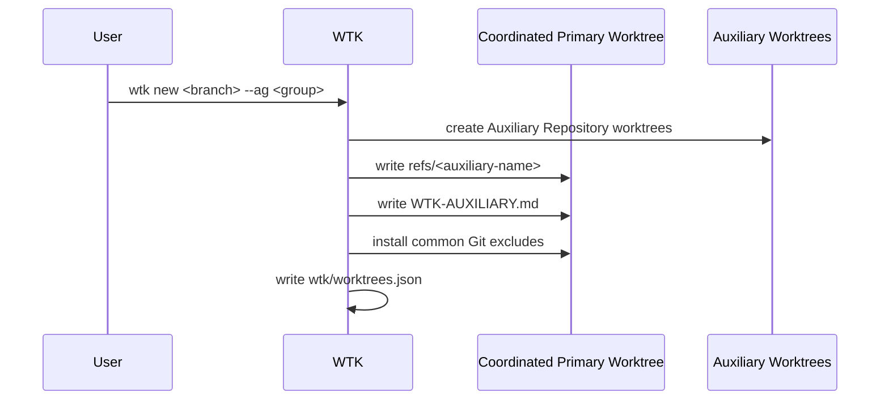

# Design

## Research

### Existing System

- The project glossary defines the Primary Repository as the repository an agent opens directly; it owns specs and may expose Auxiliary Repositories for coordinated code changes. Source: `CONTEXT.md:11-17`.
- An Auxiliary Group is selected when creating a Primary Repository worktree; zero selected groups is Standalone Mode and one or more selected groups is Coordinated Mode. Source: `CONTEXT.md:23-33`.
- README documents that `wtk new --ag <group>` creates matching Auxiliary Repository worktrees, writes generated `refs/<auxiliary-name>` entries in the Primary worktree, and stores fixed expanded state in `$(git rev-parse --git-common-dir)/wtk/worktrees.json`. Source: `README.md:16-18,111-120`.
- Auxiliary Group config is stored in the Git common dir at `wtk/config.toml`; WTK still reads legacy `.wtk/config.toml` when the private file is absent. Source: `README.md:88-118`, `src/auxiliary.rs:90-157`.
- `src/auxiliary.rs` models Auxiliary Repository Refs, Auxiliary Groups, per-worktree state, and Auxiliary worktree markers. Source: `src/auxiliary.rs:9-74`.
- Current private auxiliary paths are `$(git rev-parse --git-common-dir)/wtk/config.toml` and `$(git rev-parse --git-common-dir)/wtk/worktrees.json`, with legacy reads from `.wtk/config.toml` and `.wtk/worktrees.json` when private files are absent. Source: `src/auxiliary.rs:560-631`.
- The CLI supports `auxiliary-group` / `ag` command parsing and repeatable `--ag` / `--auxiliary-group` flags for `wtk new`. Source: `src/cli.rs:253-330`.
- Group expansion fails on unknown groups, empty groups, missing auxiliary refs, non-absolute paths, basename mismatches, and non-main-worktree auxiliary repository paths; duplicate selected repositories are deduplicated. Source: `src/auxiliary.rs:160-230`.
- `wtk new` dispatches to coordinated creation only when `Options.auxiliary_groups` is non-empty; otherwise it uses the ordinary single-repository worktree creation path. Source: `src/worktree.rs:120-165`.
- Coordinated creation writes generated `refs/<auxiliary-name>`, writes an Auxiliary marker in each Auxiliary worktree, and records expanded state keyed by absolute Primary worktree path. Source: `src/worktree.rs:266-317`.
- `wtk send-out` and `wtk bring-in` reject worktrees with auxiliary state. Source: `src/worktree.rs:818-936`.
- The previous implemented spec removed generated Workspace `AGENTS.md` guidance along with legacy Workspace command entrypoints and artifacts. Source: `specs/change/20260612-workspace-spec-helper-repo-refs/spec.md:27-29`, `specs/change/20260612-workspace-spec-helper-repo-refs/steps.md:26-34`.
- The current working tree has no `AGENTS.md` or `WTK-AUXILIARY.md` at the repository root. Source: read-only repository scan by explorer subagent Bohr, 2026-06-14.

### Design Inputs

- The previous Workspace `AGENTS.md` guidance told agents that the workspace was the shared entrypoint, feature code lived through generated refs, manifest state was tracked, and generated refs were local state. Source: `specs/change/20260612-workspace-spec-helper-repo-refs/design.md:7-17`.
- The latest historical Workspace `AGENTS.md` template said to edit feature code through generated refs, open PRs in each modified linked repository, treat `.wtk-workspace.toml` as tracked state, and not commit `refs/`. Source: `da3783349f75b8fd82f00f00ba481c5bd4840016:src/templates/workspace/AGENTS.md`.
- The new model deliberately keeps specs in the Primary Repository and states that Auxiliary Repositories participate in coordinated code changes and PRs, not spec storage. Source: `specs/change/20260612-workspace-spec-helper-repo-refs/spec.md:14-28`.
- Current user request asks for `WTK-AUXILIARY.md` as the replacement reminder mechanism because `AGENTS.md` changes no longer exist after replacing Workspace Mode with Auxiliary Repositories. Source: user request, 2026-06-14.
- Current user request requires fact sources for facts confirmed through code, docs, or web research. Source: user request, 2026-06-14; `/Users/william/.agents/skills/zest-dev/research.md`.

### Constraints & Dependencies

- `WTK-AUXILIARY.md` should use current glossary terms: Primary Repository, Auxiliary Repository, Auxiliary Repository Ref, Auxiliary Group, Standalone Mode, and Coordinated Mode. Source: `CONTEXT.md:11-37`.
- The file must not imply that Auxiliary Repositories are spec stores, because specs remain in the Primary Repository. Source: `specs/change/20260612-workspace-spec-helper-repo-refs/spec.md:14-28`.
- The file should not describe `.wtk-workspace.toml`, Workspace Repository, Workspace Worktree, Linked Repository, or Workspace Manifest as active concepts. Source: `CONTEXT.md:23-33`; `specs/change/20260612-workspace-spec-helper-repo-refs/spec.md:27-29`.
- The project prefers observable failure for missing config, bad inputs, failed subprocesses, violated invariants, and hidden fallback data. Source: AGENTS.md instructions supplied in conversation, 2026-06-14.

### Key References

- `CONTEXT.md:11-37` - current canonical Primary/Auxiliary terminology.
- `README.md:88-120` - documented Auxiliary Group setup and coordinated worktree behavior.
- `src/auxiliary.rs:9-230` - auxiliary config, state, validation, and group expansion.
- `src/auxiliary.rs:560-631` - private and legacy auxiliary config/state paths.
- `src/cli.rs:253-330` - auxiliary command and flag parsing.
- `src/worktree.rs:120-317` - ordinary vs coordinated worktree creation and generated ref/state writes.
- `src/worktree.rs:818-936` - unsupported `send-out` / `bring-in` checks for auxiliary state.
- `specs/change/20260612-workspace-spec-helper-repo-refs/spec.md:14-29` - prior accepted model decisions.
- `specs/change/20260612-workspace-spec-helper-repo-refs/design.md:7-17` - prior generated Workspace `AGENTS.md` behavior to adapt.
- `da3783349f75b8fd82f00f00ba481c5bd4840016:src/templates/workspace/AGENTS.md` - historical generated Workspace guidance text.

## Design Detail

### Design Decisions

- Generate `WTK-AUXILIARY.md` into each coordinated Primary worktree instead of committing it as a long-lived Primary Repository document. The file is worktree-specific guidance derived from fixed auxiliary state, and it should remain ignored by Git. Source: user confirmation, 2026-06-14; `src/worktree.rs:266-317`; `README.md:118-120`.
- Include concrete auxiliary entries in `WTK-AUXILIARY.md`: each Auxiliary Repository name, its `refs/<name>` path, and the resolved Auxiliary worktree target. Do not dump the raw `.wtk/worktrees.json` entry into the file. Source: user confirmation, 2026-06-14; `src/auxiliary.rs:50-60`; `src/worktree.rs:266-317`.
- Treat `WTK-AUXILIARY.md` generation and ignore-rule installation as required synchronous coordinated-worktree creation steps. If writing the file or its ignore rule fails, `wtk new --ag` should fail and use the existing rollback path instead of reporting success with missing agent guidance. Source: user acceptance of recommendation, 2026-06-14; AGENTS.md instructions supplied in conversation, 2026-06-14; `src/worktree.rs:235-329`.
- Keep `WTK-AUXILIARY.md` and `refs/` ignored through the true common Git exclude file, `.git/info/exclude`, instead of tracked `.gitignore` or worktree-specific `config.worktree` / `core.excludesFile`. This avoids p10k problems caused by per-worktree exclude config. Source: user clarification, 2026-06-14; `src/auxiliary.rs:430-504`; `src/worktree.rs:314-317`.
- Do not make `WTK-AUXILIARY.md` part of later status/remove state validation. The file is an agent hint, while coordinated state remains in `wtk/worktrees.json`, Auxiliary markers, and generated refs. Source: user confirmation, 2026-06-14; `src/auxiliary.rs:34-74`; `src/worktree.rs:384-457,511-572`.

Derived rules:

- Standalone Primary worktrees do not receive `WTK-AUXILIARY.md`.
- The Primary Repository main worktree does not receive `WTK-AUXILIARY.md` merely because Auxiliary Groups exist in config.
- Coordinated Primary worktree creation writes `WTK-AUXILIARY.md` after auxiliary refs/state are known.
- `WTK-AUXILIARY.md` is local generated state and must be excluded from commits, matching the treatment of generated `refs/`.
- The file can be deleted with its worktree; no separate cleanup is needed when `wtk remove` removes the coordinated Primary worktree.
- Ignore installation should add `/refs/` and `/WTK-AUXILIARY.md` to `.git/info/exclude` in the repository's Git common dir.
- The file tells agents to use the listed `refs/<name>` entries as the editing entrypoints for Auxiliary Repositories.
- The file tells agents not to edit or commit generated `refs/` files themselves.
- The file tells agents that specs remain in the Primary Repository, not in Auxiliary Repositories.
- The file tells agents to open PRs in each repository that actually receives code changes.
- A failure to write `WTK-AUXILIARY.md` or make it ignored is a failed coordinated creation, not a warning-only condition.
- Deleting `WTK-AUXILIARY.md` after creation does not make `wtk status` or `wtk remove` fail.
- WTK does not need to auto-regenerate `WTK-AUXILIARY.md` during `status`, `list`, or `remove`.

### System Procedure

### Guidance Content

`WTK-AUXILIARY.md` should be concise and operational:

- Title: `# WTK Auxiliary Guidance`.
- State that the current directory is a coordinated Primary Repository worktree.
- State that specs and planning artifacts remain in the Primary Repository.
- List each Auxiliary Repository with:
  - name
  - `refs/<name>` entrypoint relative to the Primary worktree
  - resolved Auxiliary worktree target path
- Tell agents to edit Auxiliary Repository code through the matching `refs/<name>` entrypoint.
- Tell agents not to edit or commit generated `refs/` entries or `WTK-AUXILIARY.md`.
- Tell agents to open PRs in every repository that receives changes.
- Avoid active Workspace terminology.

### Change Scope

Impact Areas:

- Coordinated Primary worktree creation now writes an additional generated guidance file.
- Common Git exclude installation expands to cover both generated `refs/` and `WTK-AUXILIARY.md`.
- E2E auxiliary-group coverage gains assertions for guidance contents and ignore behavior.
- No schema change is required for `wtk/config.toml` or `wtk/worktrees.json`.
- No new status/list/remove validation contract is introduced.

Planned File Changes:

- `src/auxiliary.rs` - add guidance rendering/writing helpers and write `/refs/` plus `/WTK-AUXILIARY.md` to `.git/info/exclude`.
- `src/worktree.rs` - call guidance writing during coordinated creation before final success and rollback on failure.
- `e2e/test_auxiliary_group.py` - assert file creation, content, ignored status, and standalone absence.
- `README.md` or `e2e/README.md` - update only if implementation makes user-facing behavior worth documenting.

### Edge Cases

- Coordinated creation cannot write `WTK-AUXILIARY.md`: fail fast and roll back the coordinated creation.
- Coordinated creation cannot install common exclude rules for `/refs/` and `/WTK-AUXILIARY.md`: fail fast and roll back the coordinated creation.
- Existing `.git/info/exclude` content must be preserved when adding generated WTK patterns.
- Standalone worktree creation must not create `WTK-AUXILIARY.md`.
- Primary main worktree with configured Auxiliary Groups but no coordinated worktree state must not receive `WTK-AUXILIARY.md`.
- User deletes `WTK-AUXILIARY.md` after creation: later `status`, `list`, and `remove` continue to rely on authoritative auxiliary state and generated refs.
- Because `/refs/` is ignored as a directory, Auxiliary names with gitignore metacharacters do not require per-ref ignore patterns.

### Verification Strategy

- Extend `e2e/test_auxiliary_group.py` coordinated creation coverage to assert generated `WTK-AUXILIARY.md` contents and ignore behavior.
- Extend existing exclude-preservation tests to cover common `.git/info/exclude` preservation if needed.
- Run `cargo test`.
- Run `uv run --project e2e pytest e2e/test_auxiliary_group.py`.
