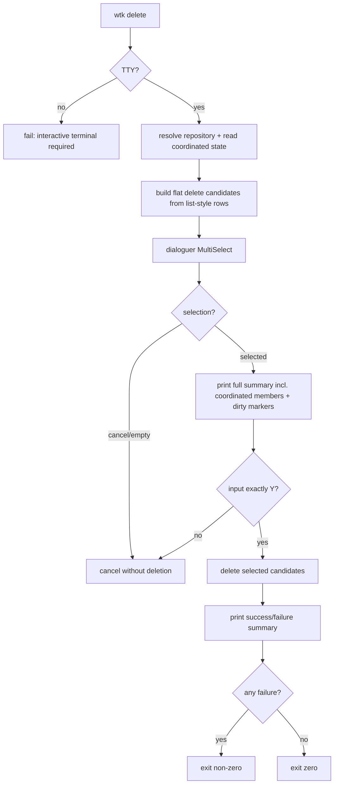

# Design

## Research

### Existing System

- The CLI is hand-written in `src/cli.rs`: top-level commands include `list` and `remove`, but there is no existing `delete` command. Source: `src/cli.rs:14-29`.
- Argument dispatch routes `list` to `parse_list` and `remove` to `parse_remove`; unknown commands fail through usage handling. Source: `src/cli.rs:278-305`.
- `wtk remove` accepts at most one optional path plus `--delete-branch` and `--no-clipboard`; no-arg `remove` is currently valid. Source: `src/cli.rs:526-550`.
- `wtk list` currently supports only `--json`; non-JSON output is a table. Source: `src/cli.rs:655-675`, `src/list.rs:74-89`.
- Repository discovery uses `git worktree list --porcelain`; the first parsed worktree becomes the main Repository Worktree, and `RepoContext` records current/main roots and all worktrees. Source: `src/gitexec.rs:225-260`.
- `wtk list` builds one `ListRow` per repository worktree, then sorts and renders those rows; it reads coordinated state and marks coordinated Primary rows as `primary_worktree` with an `auxiliary_refs` summary. Source: `src/worktree.rs:441-480`.
- The list model is flat: `ListOutput` has `worktrees: Vec<ListRow>`, and table rendering iterates rows directly with no grouped/collapsed sections. Source: `src/list.rs:16-41`, `src/list.rs:371-430`.
- List rows already include display name, absolute path, branch, current/main flags, dirty status, labels, diagnostics, updated time, short head, and optional Auxiliary Ref details. Source: `src/list.rs:22-41`.
- Dirty, main, current, locked, prunable, detached, and bare states are represented as labels; dirty state is computed with `git status --porcelain=v1 --untracked-files=all`, with generated auxiliary refs ignored for coordinated Primary rows. Source: `src/list.rs:119-150`, `src/list.rs:181-208`, `src/list.rs:326-342`, `src/worktree.rs:449-467`.
- `wtk list` sorting is by newest HEAD commit timestamp, then current, main, and display name. Source: `src/list.rs:91-100`.
- `wtk list` table columns are marker, worktree display name, branch text, updated, state, and short head; docs say absolute paths are omitted from default output and included in JSON. Source: `src/list.rs:371-430`, `docs/user-guide.md:68-82`.
- Docs describe `wtk list` as showing ordinary and coordinated Primary Repository worktrees together, with Auxiliary Ref health summaries such as `refs 2/2 ok`; this matches the flat table model with inline coordinated summary. Source: `docs/user-guide.md:151-162`.

### Existing Removal Behavior

- `wtk remove` with no path removes the current linked worktree, but fails from the main worktree because a path is required there. Source: `src/worktree.rs:747-758`.
- `wtk remove` rejects targets that are not linked worktrees and rejects the main worktree path. Source: `src/worktree.rs:760-771`.
- For a coordinated Primary Repository worktree, `wtk remove` validates branch/ref state, requires the Primary and all Auxiliary Repository worktrees to be clean, removes each Auxiliary Repository worktree, force-removes the Primary Repository worktree, then removes coordinated state. Source: `src/worktree.rs:522-595`.
- Removing from an Auxiliary Repository side worktree is rejected with `remove is not supported for worktrees with auxiliary state`. Source: `src/worktree.rs:784-788`, `e2e/test_auxiliary_group.py:499-523`.
- Plain linked worktree removal requires the worktree to be clean, runs `git worktree remove`, and optionally deletes the local branch with `git branch -d`. Source: `src/worktree.rs:789-827`.
- Coordinated removal preflights branch deletion and locked worktrees; e2e tests assert failures leave the Primary and Auxiliary Repository worktrees and state intact. Source: `e2e/test_auxiliary_group.py:693-731`, `e2e/test_auxiliary_group.py:734-771`.
- Existing docs say `wtk remove` removes a coordinated set and `wtk remove --delete-branch` removes primary and auxiliary worktrees and branches after preflight checks. Source: `docs/user-guide.md:162`.

### Design Inputs

- No prompt/TUI library is currently declared; dependencies are limited to serialization/hash/TOML/globset crates. Source: `Cargo.toml:6-12`.
- Style/color is already gated on stdout being a terminal and `NO_COLOR` not being set. Source: `src/cli.rs:273-276`.
- Current list output has a stable JSON surface for scripts; docs explicitly recommend `wtk list --json` for scripts. Source: `docs/user-guide.md:76-82`.
- Auxiliary Group definitions are config-level objects; existing worktree coordinated state is stored separately in `.wtk/worktrees.json` keyed by absolute Primary Repository worktree path, and changing config later does not mutate existing worktrees. Source: `docs/user-guide.md:151-160`, `src/auxiliary.rs:333-389`.
- Auxiliary Group listing is implemented separately from Repository Worktree listing; `wtk list` shows worktree state, not configured groups. Source: `src/auxiliary.rs:263-313`, `src/worktree.rs:441-480`.

### Constraints & Dependencies

- Adding `wtk delete` requires adding a new top-level command and parser/dispatcher path because it does not exist today. Source: `src/cli.rs:14-29`, `src/cli.rs:278-305`.
- Because no interactive dependency exists today, an interactive selector either needs a new dependency or a small in-repo terminal interaction implementation. Source: `Cargo.toml:6-12`.
- `wtk remove` currently refuses dirty worktrees, including coordinated members; allowing dirty deletion in the new interactive flow cannot simply call existing `remove` unchanged. Source: `src/worktree.rs:545-549`, `src/worktree.rs:789-790`.
- `wtk list` is currently flat, not folded/grouped; changing default grouping would alter the documented scanning-oriented table behavior. Source: `src/list.rs:16-41`, `src/list.rs:371-430`, `docs/user-guide.md:74`.
- Existing e2e coverage for list/remove/coordinated workflows lives in black-box tests under `e2e/`, especially repository mode and auxiliary group tests. Source: `e2e/test_auxiliary_group.py:469-771`.

### Key References

- CLI parse/dispatch: `src/cli.rs:14-29`, `src/cli.rs:278-305`, `src/cli.rs:526-675`.
- Worktree list/remove core: `src/worktree.rs:441-480`, `src/worktree.rs:522-595`, `src/worktree.rs:747-835`.
- List model/rendering: `src/list.rs:16-41`, `src/list.rs:91-150`, `src/list.rs:181-208`, `src/list.rs:326-430`.
- Git worktree discovery: `src/gitexec.rs:225-309`.
- Auxiliary state/config helpers: `src/auxiliary.rs:263-313`, `src/auxiliary.rs:333-460`, `src/auxiliary.rs:499-535`.
- User docs: `docs/user-guide.md:68-82`, `docs/user-guide.md:112-162`.
- Coordinated e2e tests: `e2e/test_auxiliary_group.py:469-771`.

## Design Detail

### Design Decisions

- Add a new top-level `wtk delete` command rather than changing `wtk remove`; `delete` owns the interactive batch workflow while existing `remove` keeps its current path/current-worktree semantics. Source: `src/cli.rs:14-29`, `src/cli.rs:526-550`, `src/worktree.rs:747-758`.
- `wtk delete` with no arguments is interactive-only and must fail fast outside a terminal instead of waiting for input; the project already uses terminal detection for output style, and list JSON remains the script-facing interface. Source: `src/cli.rs:273-276`, `docs/user-guide.md:76-82`.
- Do not change default `wtk list` output in this Spec. The current list contract is a flat scanning table and JSON `worktrees` array; `wtk delete` should use a similar flat row presentation rather than forcing list grouping. Source: `src/list.rs:16-41`, `src/list.rs:371-430`, `docs/user-guide.md:74`.
- Build `wtk delete` candidates from the same repository/list facts as `wtk list`: display name, branch/ref text, updated time, state labels, short head, dirty/current/main flags, diagnostics, and Auxiliary Ref summary. Source: `src/worktree.rs:441-480`, `src/list.rs:22-41`, `src/list.rs:371-430`.
- Exclude protected roots from selection: the main Repository Worktree is not deletable, and the current Repository Worktree is not selected/deleted by this batch command. Source: `src/worktree.rs:747-771`, `src/list.rs:119-150`.
- Selecting a coordinated Primary Repository worktree deletes its recorded coordinated set: the Primary Repository Worktree and all recorded Auxiliary Repository Worktrees. This matches existing `wtk remove` coordinated semantics while keeping `wtk delete` selection flat. Source: `src/worktree.rs:522-595`, `docs/user-guide.md:162`.
- Do not support selecting Auxiliary-side worktrees directly; existing removal rejects auxiliary-side worktrees, and coordinated deletion should be initiated from the recorded Primary Repository worktree row. Source: `src/worktree.rs:784-788`, `e2e/test_auxiliary_group.py:499-523`.
- Allow dirty selected worktrees in `wtk delete` after exact `Y` confirmation; this requires a new force-removal path because current `wtk remove` rejects dirty standalone and coordinated members. Source: `src/worktree.rs:545-549`, `src/worktree.rs:789-790`.
- Keep structural safety checks: locked worktrees, broken refs, and branch/ref drift should fail visibly rather than be hidden by force deletion. Existing coordinated tests already assert locked and preflight failures preserve worktrees/state. Source: `src/worktree.rs:531-556`, `e2e/test_auxiliary_group.py:576-689`, `e2e/test_auxiliary_group.py:693-771`.
- `wtk delete` never deletes branches. Existing branch deletion is an explicit `--delete-branch` behavior on `wtk remove`; the interactive delete command should remove worktrees only. Source: `src/worktree.rs:550-585`, `src/worktree.rs:801-827`, `docs/user-guide.md:162`.
- Use `dialoguer` for the multi-select interaction because it provides Space/Enter multi-select and cancelable `interact_opt()` while fitting a small hand-written CLI. Source: `Cargo.toml:6-12`, `https://docs.rs/dialoguer/latest/dialoguer/struct.MultiSelect.html`, `https://crates.io/crates/dialoguer`.
- Implement the final destructive confirmation in WTK as exact line input requiring uppercase `Y`, not `dialoguer::Confirm`, because `Confirm` is a y/n prompt rather than literal `Y`-only confirmation. Source: `https://docs.rs/dialoguer/latest/dialoguer/struct.Confirm.html`.

### System Structure

### System Procedure

1. Parse `wtk delete` with no positionals or flags except help.
2. Require interactive terminal for stdin/stdout before rendering the selector.
3. Resolve the Primary Repository context and coordinated state.
4. Build flat candidates in the same order and with the same core fields as `wtk list`.
5. Mark/omit non-selectable rows: main, current, auxiliary-side state, and rows with structural diagnostics that cannot be safely removed.
6. Run a multi-select prompt with Space toggling and Enter submitting.
7. If canceled or empty, report cancellation and exit successfully without deletion.
8. Print a full summary with absolute paths, branch/ref text, dirty markers, and coordinated members that will be removed.
9. Read one confirmation line; only exact `Y` proceeds.
10. Delete selected candidates one by one. Coordinated candidates delete each Auxiliary Repository Worktree then the Primary Repository Worktree and update state.
11. Print successful and failed deletion summaries. Any failure returns non-zero.

### Interfaces / APIs

- CLI:
  - `wtk delete`: interactive batch delete.
  - `wtk delete --help`: usage text.
- No `wtk list` CLI change in this Spec.
- Internal likely seams:
  - reusable list/candidate builder over `RepoContext` + auxiliary state;
  - force worktree removal helper that does not delete branches;
  - interactive delete runner separated enough to e2e-test through a pseudo-terminal.

### Change Scope

Impact Areas:
- CLI command parsing and help text: add `delete` without changing `remove` semantics.
- Worktree operations: add interactive batch delete, force deletion for confirmed dirty worktrees, coordinated set handling, summary/error reporting.
- List/candidate modeling: reuse or adapt list rows while preserving `wtk list` output.
- Dependencies: add `dialoguer` for human TTY multi-select.
- Tests/docs: add e2e coverage for interactive delete and update user-facing docs.

Planned File Changes:
- `Cargo.toml` / lockfile: add `dialoguer` dependency.
- `src/cli.rs`: parse/dispatch/help for `wtk delete`.
- `src/worktree.rs`: interactive delete command orchestration and deletion execution helpers, likely sharing coordinated removal internals.
- `src/list.rs`: expose/reuse formatting or row-building helpers as needed without changing default output.
- `e2e/`: add pseudo-terminal driven tests for interactive delete and coordinated/dirty behavior.
- `docs/user-guide.md` and `README.md` if needed: document `wtk delete` and its safety semantics.

### Edge Cases

- Non-TTY invocation of `wtk delete` fails immediately with a clear error.
- No deletable candidates exits without deletion and explains why.
- Empty selection or prompt cancellation exits without deletion.
- Any confirmation input other than exact `Y` cancels.
- Dirty worktrees are allowed only after `Y`; no stash/backup is attempted.
- Locked worktrees, broken refs, branch drift, and missing coordinated members fail visibly.
- Coordinated partial failure reports successful and failed member removals and returns non-zero.
- Branches remain after deletion.
- Long worktree/branch display fields are truncated with an ellipsis in the selector; full paths/branches appear in the confirmation summary.

### Verification Strategy

- Add black-box e2e tests for standalone interactive deletion, cancellation, exact `Y` confirmation, dirty force deletion, branch preservation, non-TTY failure, and coordinated cascading deletion.
- Re-run existing repository mode and auxiliary group e2e tests to ensure `wtk remove` and `wtk list` behavior remain compatible.
- Include at least one failure-path test where a selected coordinated set has a locked/broken member and the command reports failure non-zero without pretending success.
